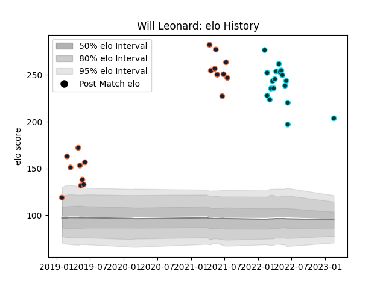

---  
layout: page  
title: Will Leonard  
date: 2023-03-21 18:10:22.179039  
categories: player  
---
# Will Leonard

Last updated: 2023-03-21
## Positions: C

## Current elo: 202.0

## Current Percentile: 100.0

# Elo History

# Match History

| Team           |   Appearances |   Win Rate |
|:---------------|--------------:|-----------:|
| R.U. New York  |            22 |   0.590909 |
| Rugby ATL      |            22 |   0.545455 |
| Rugby New York |            18 |   0.611111 |

| Opponent               |   Matches |   Win Rate |
|:-----------------------|----------:|-----------:|
| NOLA Gold              |         9 |   0.666667 |
| Toronto Arrows         |         8 |   0.875    |
| Houston SaberCats      |         7 |   1        |
| New England Free Jacks |         6 |   0.333333 |
| San Diego Legion       |         6 |   0.5      |
| Seattle Seawolves      |         5 |   0.2      |
| Old Glory DC           |         4 |   1        |
| L. A. Giltinis         |         3 |   0.666667 |
| Utah Warriors          |         3 |   0        |
| Austin Elite Rugby     |         2 |   1        |
| Austin Gilgronis       |         2 |   0.5      |
| R.U. New York          |         2 |   0        |
| Rugby ATL              |         2 |   0.5      |
| Rugby New York         |         2 |   0        |
| Glendale Raptors       |         1 |   0        |