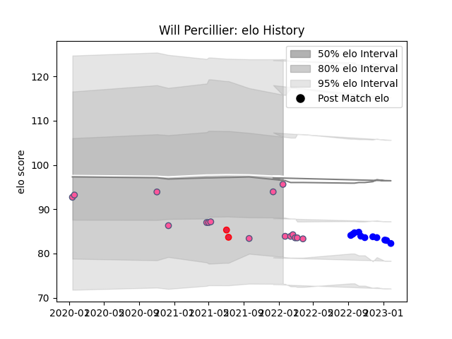

---  
layout: page  
title: Will Percillier  
date: 2023-01-13 11:25:27.341613  
categories: player  
---
# Will Percillier

## Positions: SH

## Country: Canada

## Current elo: 96.0

## Current Percentile: None

# Elo History

# Match History

| Team                 |   Appearances |   Win Rate |
|:---------------------|--------------:|-----------:|
| Stade Francais Paris |            16 |       0.5  |
| Vannes               |            10 |       0.35 |
| Canada               |             2 |       0    |

| Opponent            |   Matches |   Win Rate |
|:--------------------|----------:|-----------:|
| Stade Toulousain    |         3 |        1   |
| Agen                |         2 |        0   |
| Brive               |         2 |        0.5 |
| Connacht            |         2 |        0.5 |
| Montauban           |         1 |        0.5 |
| Wales               |         1 |        0   |
| Toulon              |         1 |        0   |
| Rouen               |         1 |        0   |
| Racing 92           |         1 |        1   |
| Pau                 |         1 |        1   |
| Oyonnax             |         1 |        0   |
| Montpellier Herault |         1 |        0   |
| Grenoble            |         1 |        1   |
| Massy               |         1 |        0   |
| Aurillac            |         1 |        0   |
| England             |         1 |        0   |
| Colomiers           |         1 |        1   |
| Carcassonne         |         1 |        1   |
| Bristol Rugby       |         1 |        0   |
| Bordeaux Begles     |         1 |        0   |
| Biarritz Olympique  |         1 |        1   |
| Benetton Treviso    |         1 |        0   |
| Zebre               |         1 |        0   |