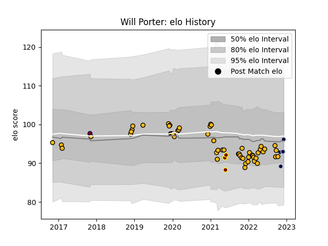

---  
layout: page  
title: Will Porter  
date: 2022-12-18 16:36:59.608640  
categories: player  
---
# Will Porter

## Positions: SH

## Current elo: 97.0

## Current Percentile: 57.0

# Elo History

# Match History

| Team             |   Appearances |   Win Rate |
|:-----------------|--------------:|-----------:|
| Wasps            |            56 |   0.383929 |
| Bristol Rugby    |             6 |   0.416667 |
| Ampthill         |             3 |   0.333333 |
| Rotherham Titans |             1 |   0        |

| Opponent            |   Matches |   Win Rate |
|:--------------------|----------:|-----------:|
| Bristol Rugby       |         6 |   0.5      |
| Gloucester Rugby    |         6 |   0.333333 |
| Saracens            |         5 |   0.2      |
| Harlequins          |         5 |   0        |
| Bath Rugby          |         5 |   1        |
| Northampton Saints  |         5 |   0.2      |
| Sale Sharks         |         5 |   0.2      |
| London Irish        |         4 |   0.625    |
| Exeter Chiefs       |         4 |   0.5      |
| Newcastle Falcons   |         4 |   0.25     |
| Leicester Tigers    |         3 |   0.5      |
| Worcester Warriors  |         2 |   0.5      |
| Stade Toulousain    |         2 |   0        |
| Edinburgh           |         2 |   0        |
| Richmond            |         1 |   1        |
| Agen                |         1 |   1        |
| Perpignan           |         1 |   1        |
| Ospreys             |         1 |   0        |
| Ealing Trailfinders |         1 |   0        |
| Bordeaux Begles     |         1 |   0        |
| Bedford             |         1 |   0        |
| Zebre               |         1 |   1        |