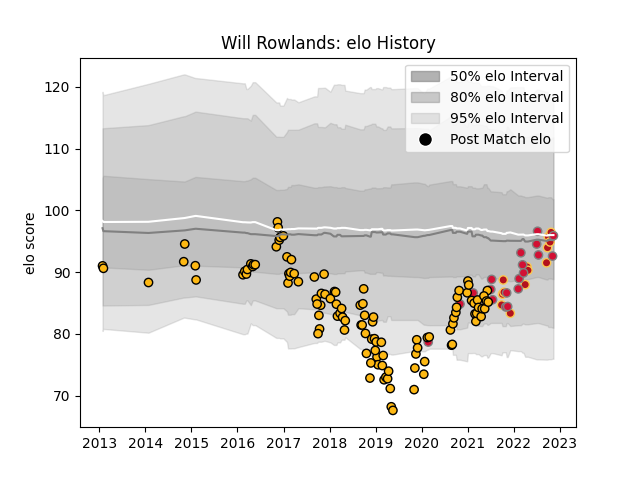

---  
layout: page  
title: Will Rowlands  
date: 2022-11-15 23:44:13.300565  
categories: player  
---
# Will Rowlands

## Positions: L

## Country: Wales

## Current elo: 96.0

## Current Percentile: 37.0

# Elo History

# Match History

| Team    |   Appearances |   Win Rate |
|:--------|--------------:|-----------:|
| Wasps   |           112 |   0.495536 |
| Wales   |            20 |   0.375    |
| Dragons |            13 |   0.307692 |

| Opponent           |   Matches |   Win Rate |
|:-------------------|----------:|-----------:|
| Sale Sharks        |        14 |   0.357143 |
| Exeter Chiefs      |        13 |   0.346154 |
| Bath Rugby         |        10 |   0.55     |
| Leicester Tigers   |         9 |   0.333333 |
| Harlequins         |         9 |   0.444444 |
| Worcester Warriors |         9 |   1        |
| London Irish       |         8 |   0.875    |
| Northampton Saints |         7 |   0.571429 |
| Newcastle Falcons  |         6 |   0.833333 |
| Gloucester Rugby   |         6 |   0.25     |
| Saracens           |         6 |   0.333333 |
| Bristol Rugby      |         5 |   0.8      |
| South Africa       |         4 |   0.25     |
| Ospreys            |         3 |   0.333333 |
| Scotland           |         3 |   0.666667 |
| Argentina          |         3 |   0.5      |
| Leinster           |         3 |   0        |
| Cardiff Blues      |         2 |   0        |
| New Zealand        |         2 |   0        |
| Scarlets           |         2 |   0.5      |
| Ireland            |         2 |   0.5      |
| Sharks             |         2 |   0        |
| France             |         2 |   0        |
| Stade Toulousain   |         2 |   0        |
| Bordeaux Begles    |         2 |   0        |
| Stormers           |         1 |   0        |
| Ulster             |         1 |   0        |
| Munster            |         1 |   1        |
| Connacht           |         1 |   1        |
| Italy              |         1 |   0        |
| Glasgow Warriors   |         1 |   0        |
| Fiji               |         1 |   1        |
| Canada             |         1 |   1        |
| England            |         1 |   0        |
| Edinburgh          |         1 |   0        |
| Agen               |         1 |   1        |