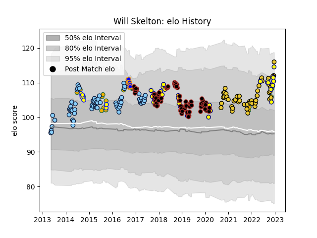

---  
layout: page  
title: Will Skelton  
date: 2022-11-16 11:40:31.405929  
categories: player  
---
# Will Skelton

## Positions: L

## Country: Australia

## Current elo: 112.0

## Current Percentile: 84.0

# Elo History

# Match History

| Team                     |   Appearances |   Win Rate |
|:-------------------------|--------------:|-----------:|
| Saracens                 |            72 |   0.743056 |
| New South Wales Waratahs |            65 |   0.584615 |
| La Rochelle              |            44 |   0.659091 |
| Nevers                   |            29 |   0.62069  |
| Australia                |            18 |   0.472222 |
| Sydney Stars             |             1 |   0.5      |

| Opponent             |   Matches |   Win Rate |
|:---------------------|----------:|-----------:|
| Brumbies             |         9 |   0.555556 |
| Exeter Chiefs        |         8 |   0.4375   |
| Melbourne Rebels     |         8 |   0.75     |
| Western Force        |         7 |   0.571429 |
| Queensland Reds      |         7 |   0.857143 |
| Clermont Auvergne    |         6 |   0.333333 |
| Stade Toulousain     |         6 |   0        |
| Leicester Tigers     |         6 |   1        |
| Gloucester Rugby     |         6 |   0.666667 |
| Lyon                 |         6 |   0.833333 |
| Racing 92            |         6 |   0.833333 |
| Sale Sharks          |         5 |   0.6      |
| Crusaders            |         5 |   0.4      |
| Highlanders          |         5 |   0.2      |
| Northampton Saints   |         5 |   0.8      |
| Soyaux-Angouleme     |         4 |   0.875    |
| New Zealand          |         4 |   0.375    |
| Hurricanes           |         4 |   0.5      |
| Stormers             |         4 |   0.75     |
| Harlequins           |         4 |   0.5      |
| Toulon               |         4 |   1        |
| Perpignan            |         4 |   0.5      |
| Wasps                |         4 |   1        |
| Brive                |         4 |   0.75     |
| Pau                  |         4 |   0.75     |
| Blues                |         4 |   0.25     |
| Ospreys              |         4 |   0.875    |
| Worcester Warriors   |         3 |   1        |
| Stade Francais Paris |         3 |   0.666667 |
| Glasgow Warriors     |         3 |   1        |
| France               |         3 |   0.666667 |
| Colomiers            |         3 |   1        |
| Chiefs               |         3 |   0.666667 |
| Castres Olympique    |         3 |   0.333333 |
| Bristol Rugby        |         3 |   0.666667 |
| Bordeaux Begles      |         3 |   1        |
| Biarritz Olympique   |         3 |   0.833333 |
| Bayonne              |         3 |   0.666667 |
| Bath Rugby           |         3 |   0.666667 |
| Newcastle Falcons    |         3 |   1        |
| Scotland             |         2 |   0.5      |
| Sharks               |         2 |   0.5      |
| Vannes               |         2 |   0        |
| Lions                |         2 |   0.5      |
| Munster              |         2 |   0.5      |
| Argentina            |         2 |   0.5      |
| England              |         2 |   0        |
| Cardiff Blues        |         2 |   1        |
| Carcassonne          |         2 |   1        |
| Grenoble             |         2 |   0.5      |
| Dax                  |         2 |   0.5      |
| Bulls                |         2 |   1        |
| London Irish         |         2 |   1        |
| Massy                |         2 |   0.5      |
| Aurillac             |         2 |   0.5      |
| Montauban            |         2 |   1        |
| Cheetahs             |         1 |   1        |
| Canberra Vikings     |         1 |   0.5      |
| Uruguay              |         1 |   1        |
| Sunwolves            |         1 |   1        |
| Wales                |         1 |   0        |
| South Africa         |         1 |   1        |
| Southern Kings       |         1 |   0        |
| Montpellier Herault  |         1 |   1        |
| Fiji                 |         1 |   1        |
| Scarlets             |         1 |   0.5      |
| Italy                |         1 |   0        |
| Leinster             |         1 |   1        |
| Provence Rugby       |         1 |   0        |
| Mont-de-Marsan       |         1 |   0        |
| Agen                 |         1 |   1        |