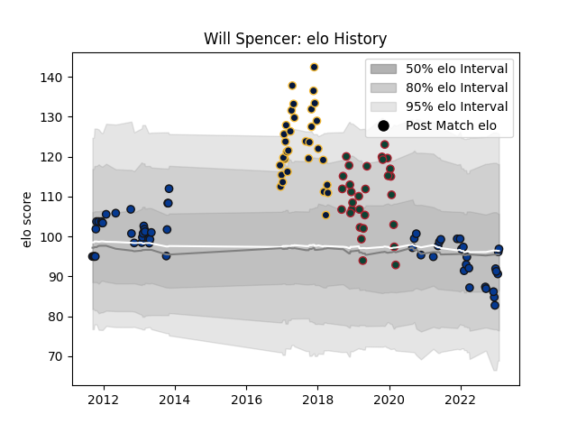

---  
layout: page  
title: Will Spencer  
date: 2022-12-14 11:16:44.417534  
categories: player  
---
# Will Spencer

## Positions: L

## Current elo: 103.0

## Current Percentile: 80.0

# Elo History

# Match History

| Team               |   Appearances |   Win Rate |
|:-------------------|--------------:|-----------:|
| Bath Rugby         |            51 |   0.470588 |
| Worcester Warriors |            32 |   0.3125   |
| Leicester Tigers   |            30 |   0.3      |

| Opponent             |   Matches |   Win Rate |
|:---------------------|----------:|-----------:|
| Sale Sharks          |        10 |   0.15     |
| Saracens             |         9 |   0.166667 |
| Northampton Saints   |         8 |   0.5      |
| Harlequins           |         8 |   0.25     |
| Gloucester Rugby     |         8 |   0.375    |
| Exeter Chiefs        |         7 |   0.142857 |
| Newcastle Falcons    |         7 |   0.571429 |
| Leicester Tigers     |         6 |   0.5      |
| Wasps                |         6 |   0.333333 |
| Worcester Warriors   |         6 |   0.666667 |
| Bristol Rugby        |         6 |   0.333333 |
| Bath Rugby           |         5 |   0.2      |
| Dragons              |         5 |   0.8      |
| London Irish         |         4 |   0.5      |
| Cardiff Blues        |         2 |   1        |
| Racing 92            |         2 |   0        |
| Glasgow Warriors     |         2 |   0        |
| Leinster             |         2 |   0        |
| Pau                  |         2 |   0.5      |
| Calvisano            |         1 |   1        |
| RC Enisei            |         1 |   1        |
| Bordeaux Begles      |         1 |   1        |
| Bucuresti            |         1 |   1        |
| Brive                |         1 |   0        |
| Scarlets             |         1 |   1        |
| Stade Francais Paris |         1 |   0        |
| Connacht             |         1 |   0        |