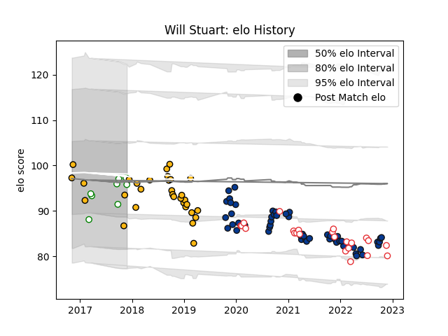

---  
layout: page  
title: Will Stuart  
date: 2022-11-22 11:41:16.325090  
categories: player  
---
# Will Stuart

## Positions: P

## Country: England

## Current elo: 89.0

## Current Percentile: 21.0

# Elo History

# Match History

| Team       |   Appearances |   Win Rate |
|:-----------|--------------:|-----------:|
| Bath Rugby |            44 |   0.306818 |
| Wasps      |            31 |   0.403226 |
| England    |            22 |   0.613636 |
| Nottingham |             4 |   0.5      |

| Opponent            |   Matches |   Win Rate |
|:--------------------|----------:|-----------:|
| London Irish        |         7 |   0.571429 |
| Exeter Chiefs       |         6 |   0.166667 |
| Sale Sharks         |         6 |   0.5      |
| Leicester Tigers    |         6 |   0.666667 |
| Gloucester Rugby    |         6 |   0.166667 |
| Northampton Saints  |         5 |   0.6      |
| Harlequins          |         5 |   0.2      |
| Worcester Warriors  |         5 |   0.8      |
| Bristol Rugby       |         5 |   0.2      |
| Australia           |         4 |   0.75     |
| Newcastle Falcons   |         4 |   0.5      |
| Wasps               |         4 |   0        |
| Saracens            |         4 |   0.125    |
| Wales               |         3 |   0.666667 |
| Scotland            |         3 |   0.333333 |
| France              |         3 |   0.333333 |
| Italy               |         3 |   1        |
| Ireland             |         3 |   0.333333 |
| Bath Rugby          |         2 |   0.25     |
| Leinster            |         2 |   0        |
| Stade Toulousain    |         2 |   0        |
| Ulster              |         2 |   0        |
| Ospreys             |         2 |   0.5      |
| New Zealand         |         1 |   0.5      |
| Clermont Auvergne   |         1 |   0        |
| Ealing Trailfinders |         1 |   1        |
| Rotherham Titans    |         1 |   1        |
| Bedford             |         1 |   0        |
| La Rochelle         |         1 |   0        |
| South Africa        |         1 |   1        |
| Tonga               |         1 |   1        |
| Doncaster           |         1 |   0        |