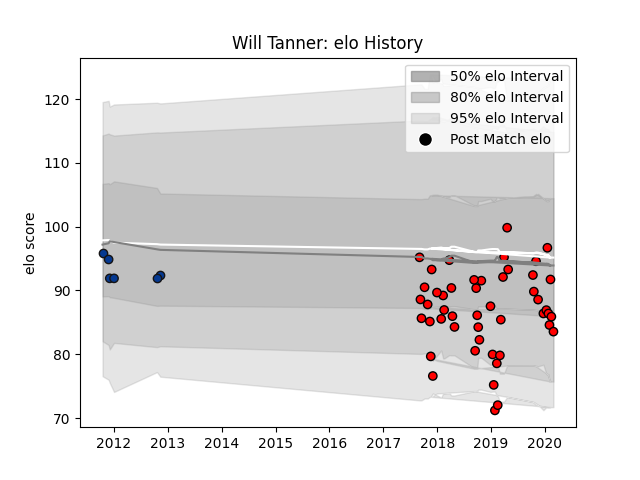

---  
layout: page  
title: Will Tanner  
date: 2022-12-31 16:28:46.888105  
categories: player  
---
# Will Tanner

## Positions: H

## Current elo: 90.0

## Current Percentile: 61.0

# Elo History

# Match History

| Team             |   Appearances |   Win Rate |
|:-----------------|--------------:|-----------:|
| Hartpury College |            49 |   0.285714 |
| Bath Rugby       |             6 |   0.666667 |

| Opponent            |   Matches |   Win Rate |
|:--------------------|----------:|-----------:|
| Ealing Trailfinders |         5 |   0        |
| Bedford             |         5 |   0.2      |
| Cornish Pirates     |         5 |   0.2      |
| Doncaster           |         5 |   0.2      |
| Richmond            |         4 |   0.25     |
| Nottingham          |         4 |   0.5      |
| Jersey              |         3 |   0.333333 |
| London Scottish     |         3 |   0.666667 |
| Yorkshire Carnegie  |         3 |   0.333333 |
| Coventry            |         3 |   0.666667 |
| Ampthill            |         2 |   0        |
| London Irish        |         2 |   0.5      |
| Dragons             |         2 |   1        |
| Newcastle Falcons   |         2 |   0        |
| Bristol Rugby       |         2 |   0        |
| Rotherham Titans    |         2 |   1        |
| Sale Sharks         |         1 |   0        |
| Worcester Warriors  |         1 |   0        |
| Agen                |         1 |   1        |