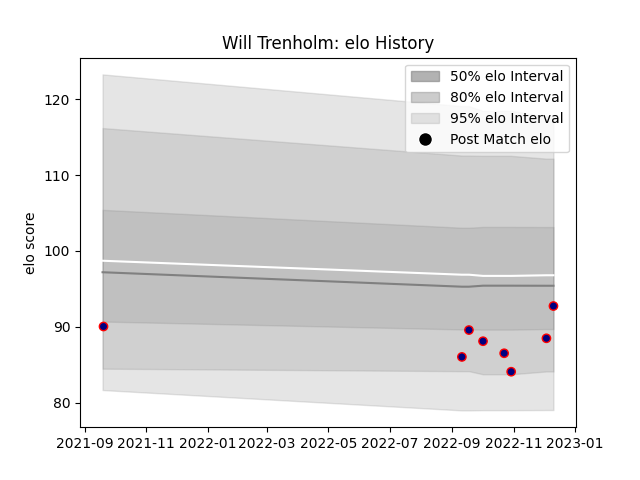

---  
layout: page  
title: Will Trenholm  
date: 2023-02-02 19:06:32.318338  
categories: player  
---
# Will Trenholm

## Positions: FL, N8

## Current elo: 95.0

## Current Percentile: 20.0

# Elo History

# Match History

| Team            |   Appearances |   Win Rate |
|:----------------|--------------:|-----------:|
| London Scottish |            14 |  0.0714286 |

| Opponent            |   Matches |   Win Rate |
|:--------------------|----------:|-----------:|
| Ampthill            |         3 |          0 |
| Bedford             |         2 |          0 |
| Richmond            |         2 |          0 |
| Caldy               |         1 |          1 |
| Cornish Pirates     |         1 |          0 |
| Doncaster           |         1 |          0 |
| Ealing Trailfinders |         1 |          0 |
| Hartpury College    |         1 |          0 |
| Jersey              |         1 |          0 |
| Nottingham          |         1 |          0 |