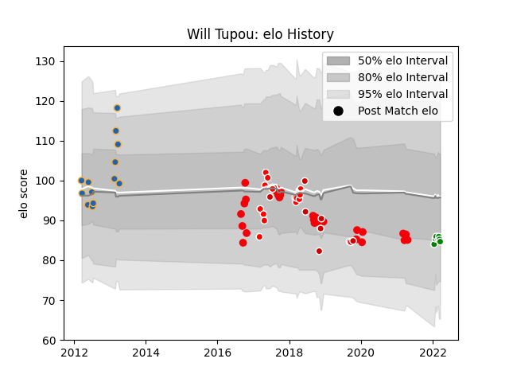

---  
layout: page  
title: Will Tupou  
date: 2023-03-17 17:33:29.924462  
categories: player  
---
# Will Tupou

## Positions: C, FB

## Country: Japan

## Current elo: 85.0

## Current Percentile: 22.0

# Elo History

# Match History

| Team                 |   Appearances |   Win Rate |
|:---------------------|--------------:|-----------:|
| Coca-Cola Red Sparks |            28 |  0.196429  |
| Sunwolves            |            14 |  0.0714286 |
| Western Force        |            13 |  0.230769  |
| Japan                |             9 |  0.444444  |
| Toyota Verblitz      |             7 |  0.428571  |

| Opponent                          |   Matches |   Win Rate |
|:----------------------------------|----------:|-----------:|
| Melbourne Rebels                  |         5 |   0        |
| Saitama Wild Knights              |         4 |   0        |
| Yokohama Canon Eagles             |         4 |   0        |
| Black Rams Tokyo                  |         3 |   0.333333 |
| Crusaders                         |         3 |   0        |
| Toyota Industries Shuttles Aichi  |         3 |   0.333333 |
| Toshiba Brave Lupus Tokyo         |         3 |   0.333333 |
| Cheetahs                          |         3 |   0        |
| Blues                             |         3 |   0.333333 |
| Lions                             |         2 |   0.5      |
| Urayasu D-Rocks                   |         2 |   0.5      |
| Southern Kings                    |         2 |   0        |
| Russia                            |         2 |   1        |
| Munakata Sanix Blues              |         2 |   0        |
| Mie Honda Heat                    |         2 |   0.5      |
| Italy                             |         2 |   0.5      |
| Kamaishi Seawaves                 |         1 |   0.5      |
| Brumbies                          |         1 |   0        |
| Chiefs                            |         1 |   0        |
| Toyota Verblitz                   |         1 |   0        |
| England                           |         1 |   0        |
| Green Rockets Tokatsu             |         1 |   0        |
| Tokyo Sungoliath                  |         1 |   0        |
| Hanazono Kintetsu Liners          |         1 |   0        |
| South Africa                      |         1 |   0        |
| Shizuoka Blue Revs                |         1 |   0        |
| Shimizu Blue Sharks               |         1 |   1        |
| Sharks                            |         1 |   0        |
| Scotland                          |         1 |   1        |
| Highlanders                       |         1 |   0        |
| Kobelco Kobe Steelers             |         1 |   0        |
| Queensland Reds                   |         1 |   1        |
| New Zealand                       |         1 |   0        |
| New South Wales Waratahs          |         1 |   1        |
| Hurricanes                        |         1 |   0        |
| Mitsubishi Dynaboars              |         1 |   0        |
| Ireland                           |         1 |   0        |
| Jaguares                          |         1 |   0        |
| Kyuden Voltex                     |         1 |   1        |
| Kurita Water Gush                 |         1 |   1        |
| Kubota Spears Funabashi Tokyo-Bay |         1 |   0        |
| Bulls                             |         1 |   0        |