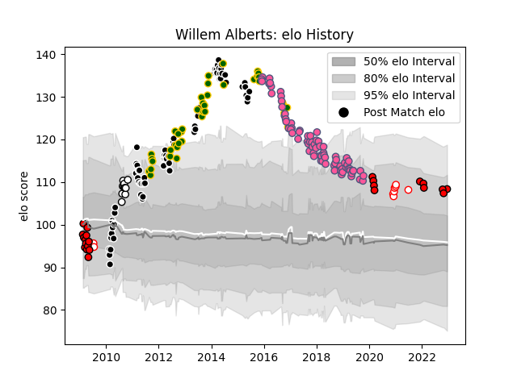

---  
layout: page  
title: Willem Alberts  
date: 2022-12-18 16:32:38.298274  
categories: player  
---
# Willem Alberts

## Positions: FL, N8

## Country: South Africa

## Current elo: 109.0

## Current Percentile: 84.0

# Elo History

# Match History

| Team                 |   Appearances |   Win Rate |
|:---------------------|--------------:|-----------:|
| Stade Francais Paris |            77 |   0.422078 |
| Sharks               |            71 |   0.577465 |
| South Africa         |            40 |   0.7125   |
| Lions                |            23 |   0.26087  |
| Natal Sharks         |            10 |   0.8      |
| Golden Lions         |             9 |   0.666667 |

| Opponent                 |   Matches |   Win Rate |
|:-------------------------|----------:|-----------:|
| Stormers                 |        13 |   0.461538 |
| Bulls                    |        10 |   0.2      |
| New Zealand              |         8 |   0.125    |
| New South Wales Waratahs |         7 |   0.285714 |
| Queensland Reds          |         7 |   0.857143 |
| Cheetahs                 |         7 |   0.857143 |
| Lions                    |         7 |   0.714286 |
| Blues                    |         7 |   0.714286 |
| La Rochelle              |         6 |   0.5      |
| Bordeaux Begles          |         6 |   0.333333 |
| Castres Olympique        |         6 |   0.5      |
| Pau                      |         6 |   0.666667 |
| Crusaders                |         6 |   0.166667 |
| Australia                |         6 |   0.666667 |
| Argentina                |         6 |   0.916667 |
| Toulon                   |         5 |   0.4      |
| Grenoble                 |         5 |   0.6      |
| Montpellier Herault      |         5 |   0.2      |
| Lyon                     |         5 |   0.2      |
| Stade Toulousain         |         5 |   0        |
| Brumbies                 |         5 |   0.6      |
| Wales                    |         5 |   1        |
| Clermont Auvergne        |         5 |   0.3      |
| Hurricanes               |         5 |   0.6      |
| Chiefs                   |         5 |   0        |
| Agen                     |         4 |   0.5      |
| Highlanders              |         4 |   0.5      |
| Racing 92                |         4 |   0.5      |
| England                  |         4 |   0.75     |
| Pumas                    |         3 |   0.666667 |
| Scotland                 |         3 |   1        |
| Western Force            |         3 |   0.666667 |
| Melbourne Rebels         |         3 |   0.666667 |
| Western Province         |         3 |   1        |
| Blue Bulls               |         3 |   0        |
| Brive                    |         3 |   0.333333 |
| Free State Cheetahs      |         3 |   1        |
| Leopards                 |         2 |   1        |
| Golden Lions             |         2 |   0.5      |
| Timisoara Saracens       |         2 |   1        |
| Sharks                   |         2 |   0        |
| Samoa                    |         2 |   1        |
| Griquas                  |         2 |   1        |
| Oyonnax                  |         2 |   0.5      |
| Ospreys                  |         2 |   0.5      |
| Harlequins               |         2 |   0.5      |
| Fiji                     |         1 |   1        |
| Ulster                   |         1 |   0        |
| United States of America |         1 |   1        |
| Benetton Treviso         |         1 |   1        |
| Edinburgh                |         1 |   0        |
| France                   |         1 |   1        |
| Stade Francais Paris     |         1 |   1        |
| Southern Kings           |         1 |   1        |
| Italy                    |         1 |   0        |
| Gloucester Rugby         |         1 |   1        |
| Ireland                  |         1 |   1        |
| Natal Sharks             |         1 |   1        |
| Namibia                  |         1 |   1        |
| Leicester Tigers         |         1 |   0        |