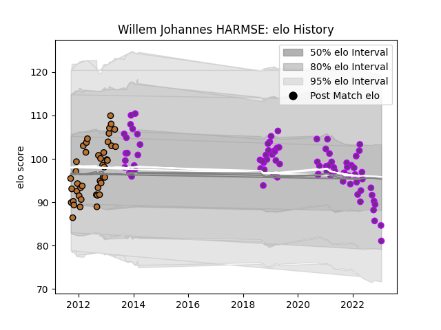

---  
layout: page  
title: Willem Johannes HARMSE  
date: 2023-01-31 16:08:00.698391  
categories: player  
---
# Willem Johannes HARMSE

## Positions: P

## Current elo: 80.0

## Current Percentile: 12.0

# Elo History

# Match History

| Team        |   Appearances |   Win Rate |
|:------------|--------------:|-----------:|
| US Bressane |            83 |   0.5      |
| Narbonne    |            43 |   0.430233 |

| Opponent                   |   Matches |   Win Rate |
|:---------------------------|----------:|-----------:|
| Aurillac                   |         7 |   0.428571 |
| Tarbes                     |         7 |   0.285714 |
| Carcassonne                |         7 |   0.571429 |
| Dax                        |         6 |   0.5      |
| Beziers                    |         6 |   0.5      |
| Oyonnax                    |         6 |   0.333333 |
| Provence Rugby             |         5 |   0.4      |
| Auch                       |         5 |   0.3      |
| Colomiers                  |         5 |   0.4      |
| Massy                      |         5 |   0.8      |
| Mont-de-Marsan             |         4 |   0.25     |
| Pau                        |         4 |   0        |
| Albi                       |         4 |   0.5      |
| Bourgoin-Jallieu           |         4 |   0.5      |
| Narbonne                   |         4 |   0.25     |
| Montauban                  |         4 |   0.375    |
| Nevers                     |         3 |   0.333333 |
| Lyon                       |         3 |   0.333333 |
| Agen                       |         3 |   0.666667 |
| Chambery                   |         3 |   0.666667 |
| Brive                      |         3 |   0.666667 |
| Blagnac                    |         3 |   0.666667 |
| Bayonne                    |         3 |   0        |
| Cognac Saint Jean d'Angély |         3 |   1        |
| Périgueux                  |         2 |   0.5      |
| Suresnes                   |         2 |   1        |
| La Rochelle                |         2 |   0.5      |
| Nice                       |         2 |   0.5      |
| Grenoble                   |         2 |   0.5      |
| Dijon                      |         2 |   1        |
| Vannes                     |         2 |   0.25     |
| Rennes                     |         1 |   1        |
| Rouen                      |         1 |   0.5      |
| Soyaux-Angouleme           |         1 |   1        |
| Carqueiranne-Hyères        |         1 |   1        |
| Biarritz Olympique         |         1 |   1        |