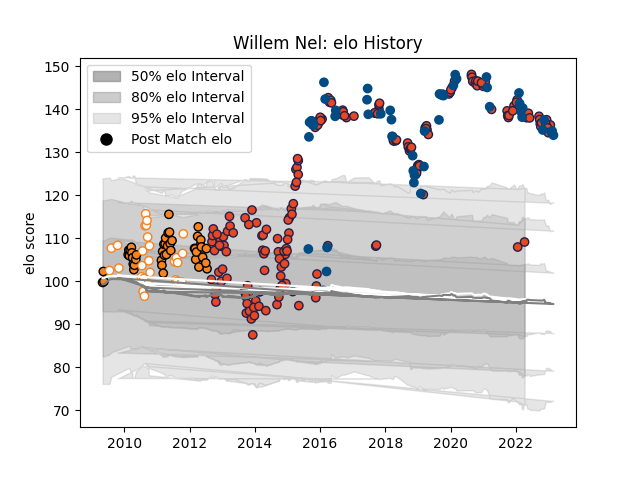

---  
layout: page  
title: Willem Nel  
date: 2023-01-31 16:07:07.433704  
categories: player  
---
# Willem Nel

## Positions: P

## Country: Scotland

## Current elo: 110.0

## Current Percentile: 99.0

# Elo History

# Match History

| Team                |   Appearances |   Win Rate |
|:--------------------|--------------:|-----------:|
| Edinburgh           |           175 |   0.514286 |
| Scotland            |            48 |   0.552083 |
| Cheetahs            |            46 |   0.315217 |
| Free State Cheetahs |            24 |   0.666667 |

| Opponent                 |   Matches |   Win Rate |
|:-------------------------|----------:|-----------:|
| Glasgow Warriors         |        20 |  0.55      |
| Munster                  |        15 |  0.133333  |
| Benetton Treviso         |        12 |  0.583333  |
| Ulster                   |        12 |  0.0833333 |
| Scarlets                 |        12 |  0.541667  |
| Cardiff Blues            |        11 |  0.363636  |
| Dragons                  |        11 |  0.909091  |
| Zebre                    |         9 |  0.777778  |
| Stormers                 |         9 |  0.0555556 |
| Connacht                 |         9 |  0.555556  |
| Italy                    |         8 |  1         |
| Leinster                 |         8 |  0.25      |
| Bulls                    |         8 |  0.125     |
| Lions                    |         7 |  0.428571  |
| Ospreys                  |         7 |  0.428571  |
| Ireland                  |         6 |  0         |
| England                  |         5 |  0.7       |
| Saracens                 |         5 |  0.4       |
| France                   |         5 |  0.6       |
| Sharks                   |         5 |  0.2       |
| Wales                    |         5 |  0         |
| New South Wales Waratahs |         4 |  0.5       |
| Golden Lions             |         4 |  0.25      |
| London Irish             |         4 |  0.75      |
| Blue Bulls               |         4 |  0.75      |
| Japan                    |         4 |  0.75      |
| Pumas                    |         4 |  1         |
| Samoa                    |         3 |  1         |
| Natal Sharks             |         3 |  0         |
| Western Province         |         3 |  0.666667  |
| Leopards                 |         3 |  1         |
| Hurricanes               |         3 |  0.666667  |
| Highlanders              |         3 |  0         |
| Australia                |         3 |  0.333333  |
| Griquas                  |         3 |  1         |
| Brumbies                 |         3 |  0.333333  |
| Gloucester Rugby         |         3 |  0.333333  |
| Perpignan                |         2 |  0.5       |
| Western Force            |         2 |  1         |
| Bordeaux Begles          |         2 |  1         |
| Toulon                   |         2 |  1         |
| South Africa             |         2 |  0         |
| Castres Olympique        |         2 |  1         |
| Chiefs                   |         2 |  0.25      |
| Racing 92                |         2 |  0         |
| Queensland Reds          |         2 |  0         |
| Crusaders                |         2 |  0.5       |
| Melbourne Rebels         |         2 |  1         |
| Grenoble                 |         2 |  0.5       |
| Harlequins               |         2 |  1         |
| London Welsh             |         2 |  1         |
| Lyon                     |         2 |  0.5       |
| Fiji                     |         2 |  0.5       |
| Montpellier Herault      |         2 |  0.5       |
| Agen                     |         2 |  1         |
| Newcastle Falcons        |         2 |  1         |
| Cheetahs                 |         1 |  1         |
| Georgia                  |         1 |  1         |
| Russia                   |         1 |  1         |
| Southern Kings           |         1 |  1         |
| Brive                    |         1 |  1         |
| New Zealand              |         1 |  0         |
| United States of America |         1 |  1         |
| Blues                    |         1 |  0         |
| Wasps                    |         1 |  1         |
| Krasny Yar               |         1 |  1         |
| Argentina                |         1 |  1         |
| Pau                      |         1 |  1         |