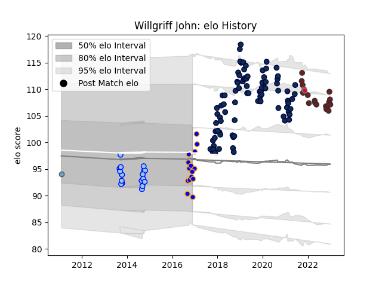

---  
layout: page  
title: Willgriff John  
date: 2023-01-05 11:28:41.530788  
categories: player  
---
# Willgriff John

## Positions: P

## Country: Wales

## Current elo: 94.0

## Current Percentile: 33.0

# Elo History

# Match History

| Team          |   Appearances |   Win Rate |
|:--------------|--------------:|-----------:|
| Sale Sharks   |            85 |   0.523529 |
| Northland     |            18 |   0.361111 |
| Scarlets      |            17 |   0.352941 |
| Doncaster     |            15 |   0.533333 |
| Wales         |             2 |   0.5      |
| Cardiff Blues |             1 |   0        |

| Opponent            |   Matches |   Win Rate |
|:--------------------|----------:|-----------:|
| Exeter Chiefs       |        10 |   0.2      |
| Leicester Tigers    |         7 |   0.571429 |
| Worcester Warriors  |         7 |   0.714286 |
| Bath Rugby          |         7 |   0.357143 |
| Harlequins          |         7 |   0.571429 |
| Northampton Saints  |         7 |   0.571429 |
| Saracens            |         6 |   0.5      |
| Gloucester Rugby    |         5 |   0.6      |
| Newcastle Falcons   |         5 |   0.4      |
| Ospreys             |         4 |   0.25     |
| London Irish        |         4 |   0.75     |
| Bristol Rugby       |         4 |   0.875    |
| Wasps               |         4 |   0.5      |
| Connacht            |         3 |   0.333333 |
| Hawke's Bay         |         3 |   0.333333 |
| Perpignan           |         2 |   1        |
| Leinster            |         2 |   0        |
| Richmond            |         2 |   1        |
| Rotherham Titans    |         2 |   1        |
| North Harbour       |         2 |   0.75     |
| Stormers            |         2 |   0        |
| Wellington          |         2 |   0.5      |
| Lions               |         2 |   0.5      |
| Otago               |         2 |   0.5      |
| Auckland            |         2 |   0        |
| La Rochelle         |         2 |   0.5      |
| Bay of Plenty       |         2 |   1        |
| Bedford             |         2 |   1        |
| Glasgow Warriors    |         2 |   0        |
| Bordeaux Begles     |         2 |   0        |
| Ealing Trailfinders |         2 |   0        |
| Dragons             |         2 |   1        |
| Canterbury          |         1 |   0        |
| Bayonne             |         1 |   1        |
| Tasman              |         1 |   0        |
| Taranaki            |         1 |   0        |
| Stade Toulousain    |         1 |   0.5      |
| Southland           |         1 |   0        |
| South Africa        |         1 |   0        |
| Scarlets            |         1 |   1        |
| Cheetahs            |         1 |   1        |
| Cardiff Blues       |         1 |   1        |
| Jersey              |         1 |   0        |
| Cornish Pirates     |         1 |   0        |
| Nottingham          |         1 |   1        |
| Edinburgh           |         1 |   0        |
| Fiji                |         1 |   1        |
| Munster             |         1 |   0        |
| Manawatu            |         1 |   0        |
| Lyon                |         1 |   0        |
| London Welsh        |         1 |   0        |
| London Scottish     |         1 |   1        |
| Yorkshire Carnegie  |         1 |   0        |