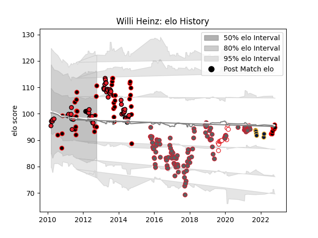

---  
layout: page  
title: Willi Heinz  
date: 2023-03-21 17:59:47.741394  
categories: player  
---
# Willi Heinz

Last updated: 2023-03-21
## Positions: SH

## Country: England

## Current elo: 95.0

## Current Percentile: 74.0

# Elo History

# Match History

| Team               |   Appearances |   Win Rate |
|:-------------------|--------------:|-----------:|
| Gloucester Rugby   |           105 |   0.538095 |
| Crusaders          |            70 |   0.685714 |
| Canterbury         |            52 |   0.778846 |
| England            |            13 |   0.846154 |
| Worcester Warriors |             6 |   0.333333 |

| Opponent                 |   Matches |   Win Rate |
|:-------------------------|----------:|-----------:|
| Exeter Chiefs            |        13 |   0.5      |
| Chiefs                   |        11 |   0.454545 |
| Northampton Saints       |        10 |   0.3      |
| Blues                    |         9 |   0.666667 |
| Worcester Warriors       |         9 |   0.722222 |
| London Irish             |         8 |   0.75     |
| Bath Rugby               |         8 |   0.5      |
| Newcastle Falcons        |         8 |   0.625    |
| Wellington               |         7 |   0.714286 |
| Harlequins               |         7 |   0.357143 |
| Leicester Tigers         |         7 |   0.285714 |
| Saracens                 |         7 |   0.428571 |
| Wasps                    |         6 |   0.5      |
| Sale Sharks              |         6 |   0.5      |
| Waikato                  |         6 |   0.666667 |
| Hurricanes               |         6 |   0.5      |
| Highlanders              |         6 |   0.833333 |
| Northland                |         5 |   1        |
| New South Wales Waratahs |         5 |   0.8      |
| Bristol Rugby            |         5 |   0.4      |
| Auckland                 |         5 |   0.8      |
| Stormers                 |         4 |   1        |
| Tasman                   |         4 |   0.75     |
| Cheetahs                 |         4 |   0.75     |
| Queensland Reds          |         4 |   0.75     |
| La Rochelle              |         4 |   0.5      |
| Brumbies                 |         4 |   1        |
| Western Force            |         4 |   0.75     |
| North Harbour            |         4 |   0.75     |
| Southland                |         3 |   0.333333 |
| Sharks                   |         3 |   0.333333 |
| Taranaki                 |         3 |   0.666667 |
| Wales                    |         3 |   0.666667 |
| Otago                    |         3 |   1        |
| Manawatu                 |         3 |   1        |
| Zebre                    |         3 |   1        |
| Counties Manukau         |         3 |   1        |
| Lions                    |         3 |   1        |
| Bay of Plenty            |         3 |   0.666667 |
| Hawke's Bay              |         3 |   0.833333 |
| Bulls                    |         3 |   0.666667 |
| Melbourne Rebels         |         2 |   0.5      |
| Ireland                  |         2 |   1        |
| Bayonne                  |         2 |   1        |
| New Zealand              |         1 |   1        |
| Australia                |         1 |   1        |
| Benetton Treviso         |         1 |   1        |
| Cardiff Blues            |         1 |   1        |
| United States of America |         1 |   1        |
| Tonga                    |         1 |   1        |
| Connacht                 |         1 |   1        |
| Stade Toulousain         |         1 |   0        |
| Fijian Drua              |         1 |   0        |
| Montpellier Herault      |         1 |   1        |
| Stade Francais Paris     |         1 |   0        |
| France                   |         1 |   0        |
| Southern Kings           |         1 |   1        |
| Gloucester Rugby         |         1 |   0        |
| Scotland                 |         1 |   1        |
| Italy                    |         1 |   1        |
| Argentina                |         1 |   1        |
| Agen                     |         1 |   1        |