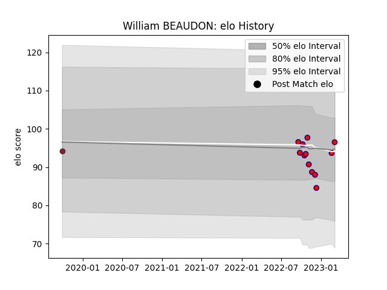

---  
layout: page  
title: William BEAUDON  
date: 2023-02-24 02:26:49.211032  
categories: player  
---
# William BEAUDON

## Positions: SH

## Current elo: 93.0

## Current Percentile: 18.0

# Elo History

# Match History

| Team                       |   Appearances |   Win Rate |
|:---------------------------|--------------:|-----------:|
| Cognac Saint Jean d'Angély |            11 |          0 |
| Toulon                     |             1 |          0 |

| Opponent            |   Matches |   Win Rate |
|:--------------------|----------:|-----------:|
| Blagnac             |         2 |          0 |
| Albi                |         1 |          0 |
| Brive               |         1 |          0 |
| Carqueiranne-Hyères |         1 |          0 |
| Chambery            |         1 |          0 |
| Dax                 |         1 |          0 |
| Narbonne            |         1 |          0 |
| Nice                |         1 |          0 |
| Rennes              |         1 |          0 |
| Suresnes            |         1 |          0 |
| US Bressane         |         1 |          0 |