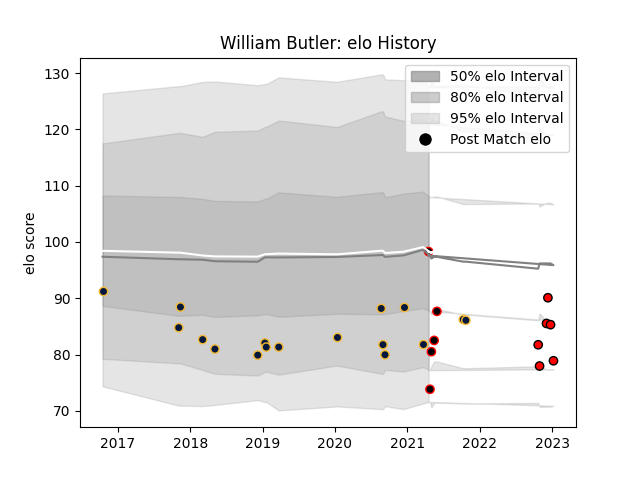

---  
layout: page  
title: William Butler  
date: 2022-12-18 16:36:05.714370  
categories: player  
---
# William Butler

## Positions: C, W

## Current elo: 97.0

## Current Percentile: 45.0

# Elo History

# Match History

| Team               |   Appearances |   Win Rate |
|:-------------------|--------------:|-----------:|
| Worcester Warriors |            17 |   0.235294 |
| Cornish Pirates    |             4 |   0.5      |
| Hartpury College   |             4 |   0.5      |

| Opponent             |   Matches |   Win Rate |
|:---------------------|----------:|-----------:|
| Ampthill             |         2 |        0.5 |
| Bath Rugby           |         2 |        0   |
| RC Enisei            |         2 |        0.5 |
| Pau                  |         2 |        0   |
| Northampton Saints   |         2 |        0   |
| Jersey               |         2 |        0   |
| Exeter Chiefs        |         2 |        0   |
| Coventry             |         2 |        1   |
| Harlequins           |         1 |        0   |
| Hartpury College     |         1 |        1   |
| Leicester Tigers     |         1 |        0   |
| Ospreys              |         1 |        1   |
| Bristol Rugby        |         1 |        1   |
| Bedford              |         1 |        0   |
| Sale Sharks          |         1 |        0   |
| Stade Francais Paris |         1 |        1   |
| Wasps                |         1 |        0   |