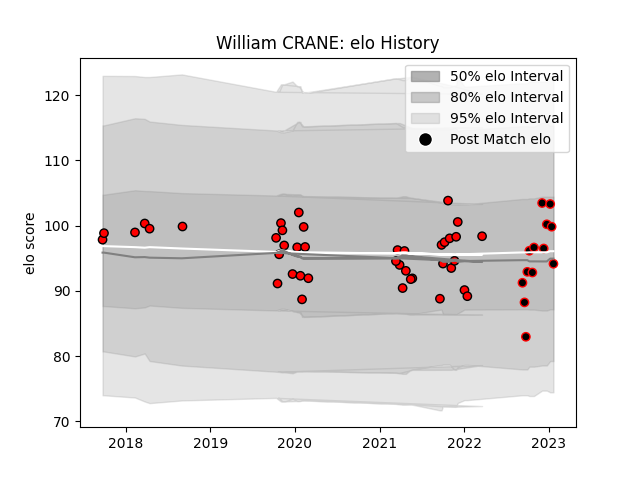

---  
layout: page  
title: William CRANE  
date: 2023-01-21 15:42:41.404524  
categories: player  
---
# William CRANE

## Positions: H

## Current elo: 100.0

## Current Percentile: 72.0

# Elo History

# Match History

| Team             |   Appearances |   Win Rate |
|:-----------------|--------------:|-----------:|
| Hartpury College |            41 |   0.329268 |
| Cornish Pirates  |            12 |   0.5      |

| Opponent            |   Matches |   Win Rate |
|:--------------------|----------:|-----------:|
| Nottingham          |         9 |   0.666667 |
| Ampthill            |         5 |   0.4      |
| Coventry            |         5 |   0.4      |
| Ealing Trailfinders |         5 |   0        |
| Bedford             |         4 |   0        |
| Cornish Pirates     |         4 |   0.25     |
| Doncaster           |         4 |   0.25     |
| Jersey              |         4 |   0        |
| London Scottish     |         3 |   1        |
| Richmond            |         3 |   0.666667 |
| Yorkshire Carnegie  |         3 |   0.833333 |
| Newcastle Falcons   |         2 |   0        |
| Caldy               |         1 |   0        |
| Hartpury College    |         1 |   0        |