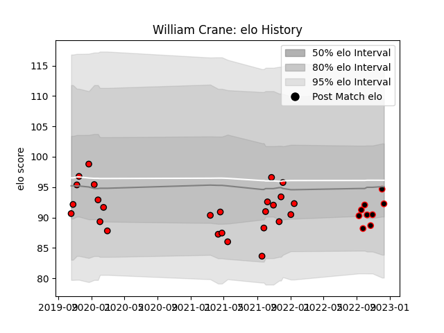

---  
layout: page  
title: William Crane  
date: 2022-12-14 11:15:01.225867  
categories: player  
---
# William Crane

## Positions: H

## Current elo: 92.0

## Current Percentile: 49.0

# Elo History

# Match History

| Team             |   Appearances |   Win Rate |
|:-----------------|--------------:|-----------:|
| Hartpury College |            26 |   0.423077 |
| Cornish Pirates  |             9 |   0.444444 |

| Opponent            |   Matches |   Win Rate |
|:--------------------|----------:|-----------:|
| Nottingham          |         6 |   0.666667 |
| Coventry            |         5 |   0.4      |
| Ampthill            |         4 |   0.5      |
| Bedford             |         3 |   0        |
| Cornish Pirates     |         3 |   0.333333 |
| Ealing Trailfinders |         3 |   0        |
| London Scottish     |         3 |   1        |
| Jersey              |         2 |   0        |
| Richmond            |         2 |   1        |
| Caldy               |         1 |   0        |
| Doncaster           |         1 |   0        |
| Newcastle Falcons   |         1 |   0        |
| Yorkshire Carnegie  |         1 |   1        |