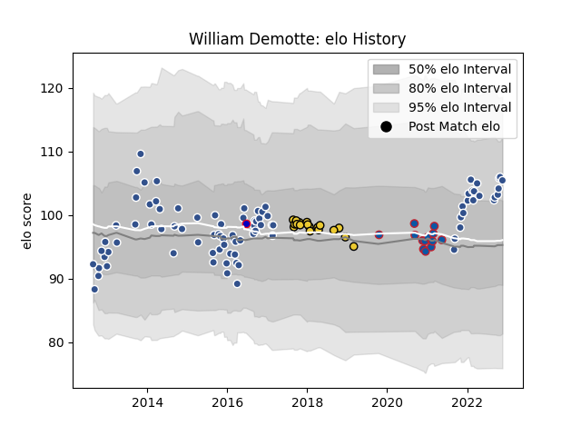

---  
layout: page  
title: William Demotte  
date: 2022-11-22 11:43:26.702391  
categories: player  
---
# William Demotte

## Positions: L

## Country: France

## Current elo: 105.0

## Current Percentile: 81.0

# Elo History

# Match History

| Team        |   Appearances |   Win Rate |
|:------------|--------------:|-----------:|
| Agen        |            86 |   0.383721 |
| La Rochelle |            18 |   0.527778 |
| Grenoble    |            13 |   0.538462 |
| France      |             1 |   0        |

| Opponent             |   Matches |   Win Rate |
|:---------------------|----------:|-----------:|
| Oyonnax              |         7 |   0.5      |
| Aurillac             |         6 |   0.5      |
| Montauban            |         6 |   0.5      |
| Beziers              |         5 |   0.2      |
| Biarritz Olympique   |         5 |   0.4      |
| Clermont Auvergne    |         4 |   0.25     |
| Brive                |         4 |   0.75     |
| Castres Olympique    |         4 |   0        |
| Carcassonne          |         4 |   0.5      |
| Stade Toulousain     |         4 |   0.25     |
| Stade Francais Paris |         4 |   0.25     |
| Montpellier Herault  |         4 |   0        |
| Grenoble             |         4 |   0        |
| Narbonne             |         4 |   0.75     |
| Pau                  |         4 |   0.25     |
| Racing 92            |         4 |   0.25     |
| Mont-de-Marsan       |         3 |   0.666667 |
| Vannes               |         3 |   0.833333 |
| Bourgoin-Jallieu     |         3 |   0.333333 |
| Dax                  |         2 |   0.5      |
| Colomiers            |         2 |   0.5      |
| Albi                 |         2 |   0.5      |
| Bucuresti            |         2 |   0.5      |
| Toulon               |         2 |   0        |
| Bordeaux Begles      |         2 |   0        |
| US Bressane          |         2 |   0.5      |
| Soyaux-Angouleme     |         2 |   1        |
| Bath Rugby           |         2 |   0        |
| Perpignan            |         2 |   0.5      |
| Provence Rugby       |         2 |   0.5      |
| Rouen                |         2 |   0.5      |
| Tarbes               |         1 |   1        |
| Ulster               |         1 |   1        |
| Agen                 |         1 |   1        |
| RC Enisei            |         1 |   1        |
| Nevers               |         1 |   1        |
| Massy                |         1 |   1        |
| Harlequins           |         1 |   1        |
| Calvisano            |         1 |   1        |
| Bristol Rugby        |         1 |   0        |
| Bayonne              |         1 |   0.5      |
| Argentina            |         1 |   0        |
| La Rochelle          |         1 |   0        |