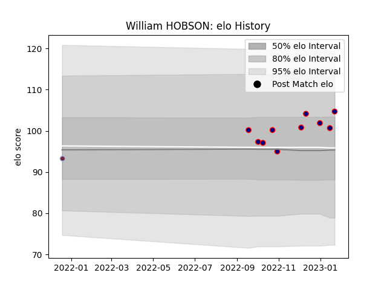

---  
layout: page  
title: William HOBSON  
date: 2023-03-11 00:12:29.412125  
categories: player  
---
# William HOBSON

## Positions: P

## Current elo: 101.0

## Current Percentile: 79.0

# Elo History

# Match History

| Team            |   Appearances |   Win Rate |
|:----------------|--------------:|-----------:|
| London Scottish |            12 |  0.0833333 |
| Harlequins      |             1 |  1         |

| Opponent            |   Matches |   Win Rate |
|:--------------------|----------:|-----------:|
| Ampthill            |         2 |          0 |
| Bedford             |         2 |          0 |
| Coventry            |         2 |          0 |
| Caldy               |         1 |          1 |
| Cardiff Blues       |         1 |          1 |
| Cornish Pirates     |         1 |          0 |
| Doncaster           |         1 |          0 |
| Ealing Trailfinders |         1 |          0 |
| Jersey              |         1 |          0 |
| Richmond            |         1 |          0 |