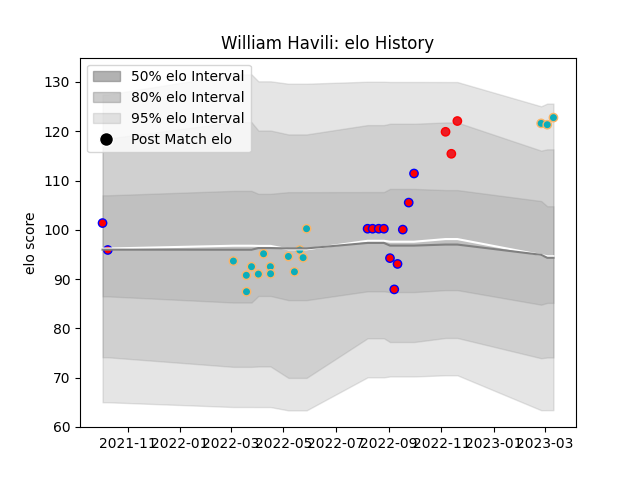

---  
layout: page  
title: William Havili  
date: 2022-11-15 23:37:28.297601  
categories: player  
---
# William Havili

## Positions: FB, FH

## Country: Tonga

## Current elo: 100.0

## Current Percentile: 53.0

# Elo History

# Match History

| Team           |   Appearances |   Win Rate |
|:---------------|--------------:|-----------:|
| Moana Pasifika |            13 |   0.153846 |
| Tasman         |            12 |   0.416667 |
| Tonga          |             2 |   1        |

| Opponent                 |   Matches |   Win Rate |
|:-------------------------|----------:|-----------:|
| Chiefs                   |         4 |          0 |
| Southland                |         2 |          1 |
| Hawke's Bay              |         2 |          0 |
| Auckland                 |         1 |          0 |
| New South Wales Waratahs |         1 |          0 |
| Wellington               |         1 |          0 |
| Taranaki                 |         1 |          1 |
| Spain                    |         1 |          1 |
| Queensland Reds          |         1 |          0 |
| Otago                    |         1 |          0 |
| Northland                |         1 |          1 |
| North Harbour            |         1 |          0 |
| Manawatu                 |         1 |          1 |
| Blues                    |         1 |          0 |
| Hurricanes               |         1 |          1 |
| Highlanders              |         1 |          0 |
| Fijian Drua              |         1 |          0 |
| Crusaders                |         1 |          0 |
| Chile                    |         1 |          1 |
| Canterbury               |         1 |          0 |
| Brumbies                 |         1 |          1 |
| Western Force            |         1 |          0 |