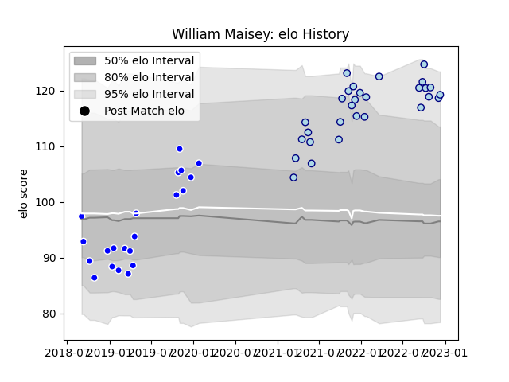

---  
layout: page  
title: William Maisey  
date: 2023-03-17 17:33:28.648817  
categories: player  
---
# William Maisey

## Positions: FH

## Current elo: 83.0

## Current Percentile: 96.0

# Elo History

# Match History

| Team     |   Appearances |   Win Rate |
|:---------|--------------:|-----------:|
| Bedford  |            41 |   0.487805 |
| Coventry |            21 |   0.52381  |

| Opponent            |   Matches |   Win Rate |
|:--------------------|----------:|-----------:|
| Doncaster           |         7 |   0.571429 |
| Cornish Pirates     |         6 |   0.5      |
| Hartpury College    |         6 |   0.833333 |
| Nottingham          |         6 |   0.583333 |
| Ealing Trailfinders |         5 |   0.1      |
| Jersey              |         5 |   0.6      |
| London Scottish     |         5 |   0.8      |
| Richmond            |         5 |   0.2      |
| Ampthill            |         4 |   0.75     |
| Coventry            |         4 |   0        |
| Yorkshire Carnegie  |         3 |   0.666667 |
| Caldy               |         2 |   0.5      |
| Newcastle Falcons   |         2 |   0        |
| Bedford             |         1 |   1        |
| Saracens            |         1 |   0        |