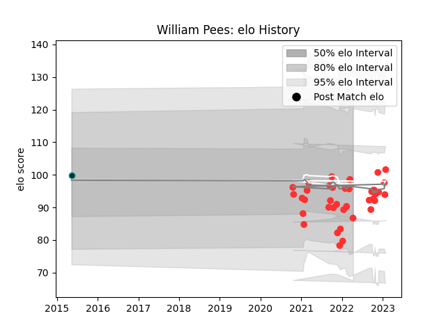

---  
layout: page  
title: William Pees  
date: 2023-03-17 17:34:26.289773  
categories: player  
---
# William Pees

## Positions: C, FH

## Current elo: 88.0

## Current Percentile: 57.0

# Elo History

# Match History

| Team   |   Appearances |   Win Rate |
|:-------|--------------:|-----------:|
| Tarbes |            39 |   0.448718 |
| Pau    |             1 |   0        |

| Opponent                   |   Matches |   Win Rate |
|:---------------------------|----------:|-----------:|
| Bourgoin-Jallieu           |         5 |   0.8      |
| Cognac Saint Jean d'Angély |         4 |   0.875    |
| Nice                       |         4 |   0.25     |
| Albi                       |         3 |   0.333333 |
| Blagnac                    |         3 |   0.166667 |
| Dax                        |         3 |   0.333333 |
| Aubenas                    |         2 |   0.5      |
| Chambery                   |         2 |   0        |
| Dijon                      |         2 |   0.75     |
| Massy                      |         2 |   0        |
| Narbonne                   |         2 |   0.5      |
| Rennes                     |         2 |   1        |
| Soyaux-Angouleme           |         2 |   0.5      |
| Valence Romans Drome Rugby |         2 |   0        |
| Carqueiranne-Hyères        |         1 |   0        |
| Suresnes                   |         1 |   0        |