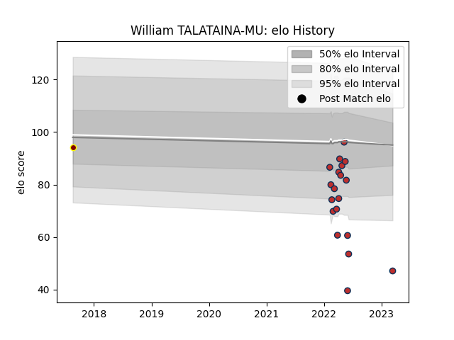

---  
layout: page  
title: William TALATAINA-MU  
date: 2023-03-16 11:30:54.326538  
categories: player  
---
# William TALATAINA-MU

## Positions: C, W

## Current elo: 47.0

## Current Percentile: 1.0

# Elo History

# Match History

| Team         |   Appearances |   Win Rate |
|:-------------|--------------:|-----------:|
| Old Glory DC |            19 |   0.157895 |
| Southland    |             1 |   0        |

| Opponent               |   Matches |   Win Rate |
|:-----------------------|----------:|-----------:|
| New England Free Jacks |         3 |   0        |
| Toronto Arrows         |         3 |   0.333333 |
| NOLA Gold              |         2 |   0        |
| R.U. New York          |         2 |   0        |
| Rugby ATL              |         2 |   0        |
| Rugby New York         |         2 |   0        |
| Austin Gilgronis       |         1 |   0        |
| Dallas Jackals         |         1 |   1        |
| Hawke's Bay            |         1 |   0        |
| Houston SaberCats      |         1 |   0        |
| San Diego Legion       |         1 |   0        |
| Utah Warriors          |         1 |   1        |