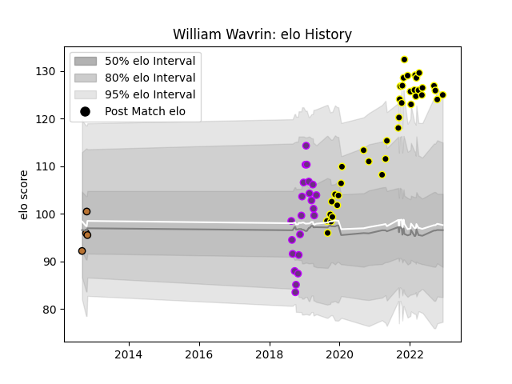

---  
layout: page  
title: William Wavrin  
date: 2022-12-14 11:22:54.407327  
categories: player  
---
# William Wavrin

## Positions: N8, FL

## Current elo: 125.0

## Current Percentile: 94.0

# Elo History

# Match History

| Team           |   Appearances |   Win Rate |
|:---------------|--------------:|-----------:|
| Mont-de-Marsan |            39 |   0.628205 |
| US Bressane    |            22 |   0.568182 |
| Narbonne       |             4 |   0.25     |

| Opponent                   |   Matches |   Win Rate |
|:---------------------------|----------:|-----------:|
| Provence Rugby             |         6 |   0.333333 |
| Oyonnax                    |         6 |   0.333333 |
| Carcassonne                |         5 |   0.6      |
| Grenoble                   |         5 |   0.6      |
| Aurillac                   |         5 |   0.6      |
| Montauban                  |         4 |   0.75     |
| Beziers                    |         4 |   0.75     |
| Colomiers                  |         4 |   0.25     |
| Nevers                     |         4 |   0.5      |
| Bayonne                    |         3 |   0.666667 |
| Biarritz Olympique         |         3 |   0.666667 |
| US Bressane                |         2 |   1        |
| Rouen                      |         2 |   0.5      |
| Agen                       |         2 |   1        |
| Perpignan                  |         2 |   0.5      |
| Massy                      |         2 |   1        |
| Vannes                     |         2 |   0.75     |
| Mont-de-Marsan             |         1 |   1        |
| Roval Drome XV             |         1 |   0        |
| Soyaux-Angouleme           |         1 |   1        |
| Valence Romans Drome Rugby |         1 |   0.5      |