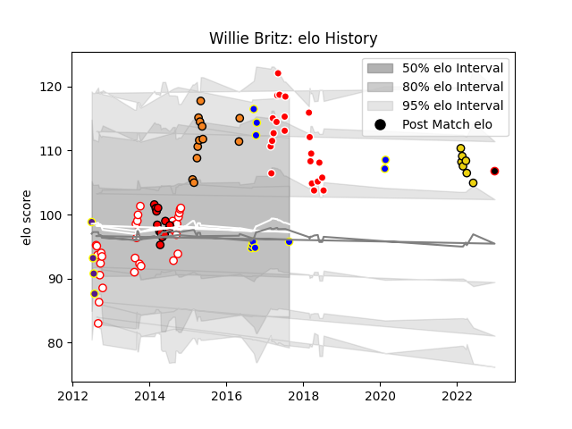

---  
layout: page  
title: Willie Britz  
date: 2022-12-28 12:52:38.707279  
categories: player  
---
# Willie Britz

## Positions: N8, FL

## Current elo: 96.0

## Current Percentile: 94.0

# Elo History

# Match History

| Team                            |   Appearances |   Win Rate |
|:--------------------------------|--------------:|-----------:|
| Golden Lions                    |            31 |   0.564516 |
| Sunwolves                       |            22 |   0.136364 |
| Lions                           |            13 |   0.461538 |
| Cheetahs                        |            12 |   0.333333 |
| Urayasu D-Rocks                 |            10 |   0.7      |
| Houston SaberCats               |             7 |   0.428571 |
| Griffons                        |             4 |   0.75     |
| NTT Docomo Red Hurricanes Osaka |             1 |   1        |

| Opponent                 |   Matches |   Win Rate |
|:-------------------------|----------:|-----------:|
| Western Province         |         7 |   0.5      |
| Natal Sharks             |         6 |   0.333333 |
| Sharks                   |         5 |   0.2      |
| Blue Bulls               |         5 |   0.6      |
| Griquas                  |         5 |   0.6      |
| Stormers                 |         5 |   0.4      |
| Free State Cheetahs      |         5 |   0.6      |
| Lions                    |         4 |   0        |
| Queensland Reds          |         4 |   0.25     |
| Chiefs                   |         4 |   0        |
| Bulls                    |         4 |   0.5      |
| Blues                    |         4 |   0.75     |
| Cheetahs                 |         3 |   0.666667 |
| Eastern Province Kings   |         3 |   0.666667 |
| Brumbies                 |         3 |   0        |
| Highlanders              |         2 |   0        |
| Melbourne Rebels         |         2 |   0.5      |
| Western Force            |         2 |   0.5      |
| Black Rams Tokyo         |         2 |   0.5      |
| Austin Gilgronis         |         2 |   0        |
| Hurricanes               |         1 |   0        |
| R.U. New York            |         1 |   0        |
| Boland Cavaliers         |         1 |   1        |
| Valke                    |         1 |   1        |
| Utah Warriors            |         1 |   1        |
| Toyota Verblitz          |         1 |   1        |
| Border Bulldogs          |         1 |   1        |
| Southern Kings           |         1 |   0        |
| Chugoku Red Regulions    |         1 |   1        |
| San Diego Legion         |         1 |   0        |
| Saitama Wild Knights     |         1 |   0        |
| Coca-Cola Red Sparks     |         1 |   1        |
| Hanazono Kintetsu Liners |         1 |   1        |
| Pumas                    |         1 |   1        |
| New South Wales Waratahs |         1 |   0        |
| Crusaders                |         1 |   0        |
| Munakata Sanix Blues     |         1 |   1        |
| Mie Honda Heat           |         1 |   1        |
| Dallas Jackals           |         1 |   1        |
| Green Rockets Tokatsu    |         1 |   1        |
| L. A. Giltinis           |         1 |   1        |
| Kobelco Kobe Steelers    |         1 |   0        |
| Jaguares                 |         1 |   0        |