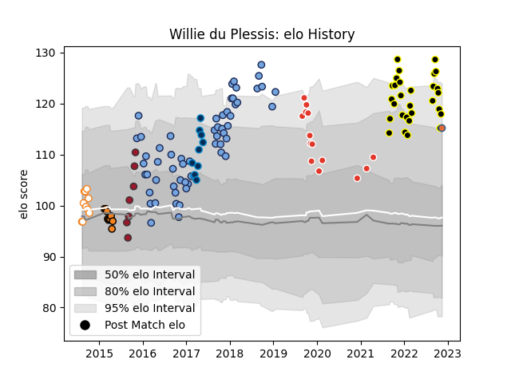

---  
layout: page  
title: Willie du Plessis  
date: 2022-12-18 16:33:25.342990  
categories: player  
---
# Willie du Plessis

## Positions: FH

## Country: Netherlands

## Current elo: 117.0

## Current Percentile: 91.0

# Elo History

# Match History

| Team                |   Appearances |   Win Rate |
|:--------------------|--------------:|-----------:|
| Bayonne             |            58 |   0.534483 |
| Mont-de-Marsan      |            33 |   0.787879 |
| Biarritz Olympique  |            14 |   0.571429 |
| Cheetahs            |            10 |   0.3      |
| Free State Cheetahs |            10 |   0.35     |
| Montpellier Herault |            10 |   0.6      |
| Toulon              |             7 |   0.428571 |
| Netherlands         |             1 |   0        |

| Opponent               |   Matches |   Win Rate |
|:-----------------------|----------:|-----------:|
| Carcassonne            |         7 |   0.571429 |
| Vannes                 |         7 |   0.714286 |
| Provence Rugby         |         6 |   0.666667 |
| Montauban              |         6 |   0.5      |
| Beziers                |         6 |   0.666667 |
| Colomiers              |         5 |   0.7      |
| Grenoble               |         5 |   0.4      |
| Racing 92              |         5 |   0.2      |
| Brive                  |         5 |   0.4      |
| Nevers                 |         5 |   0.6      |
| Biarritz Olympique     |         5 |   0.4      |
| Oyonnax                |         5 |   0.8      |
| Aurillac               |         5 |   0.8      |
| Rouen                  |         4 |   0.75     |
| Narbonne               |         4 |   1        |
| Mont-de-Marsan         |         4 |   0.5      |
| Massy                  |         4 |   0.75     |
| La Rochelle            |         4 |   0.25     |
| Agen                   |         3 |   0.666667 |
| Soyaux-Angouleme       |         3 |   0.666667 |
| Dax                    |         3 |   0.833333 |
| Stade Francais Paris   |         3 |   0.666667 |
| Castres Olympique      |         3 |   0.166667 |
| Sharks                 |         2 |   0.5      |
| Clermont Auvergne      |         2 |   1        |
| Griquas                |         2 |   1        |
| Lyon                   |         2 |   0.25     |
| Stade Toulousain       |         2 |   1        |
| Natal Sharks           |         2 |   0.25     |
| Bayonne                |         2 |   1        |
| Pumas                  |         2 |   0        |
| Tarbes                 |         1 |   1        |
| Toulon                 |         1 |   1        |
| Queensland Reds        |         1 |   0        |
| US Bressane            |         1 |   1        |
| Western Force          |         1 |   1        |
| Lions                  |         1 |   0        |
| Perpignan              |         1 |   0        |
| Montpellier Herault    |         1 |   0        |
| Albi                   |         1 |   1        |
| Golden Lions           |         1 |   0        |
| Eastern Province Kings |         1 |   1        |
| Crusaders              |         1 |   0        |
| Chiefs                 |         1 |   0        |
| Canada                 |         1 |   0        |
| Bulls                  |         1 |   0        |
| Brumbies               |         1 |   0        |
| Bordeaux Begles        |         1 |   0        |
| Blues                  |         1 |   1        |
| Blue Bulls             |         1 |   0        |
| Western Province       |         1 |   0        |