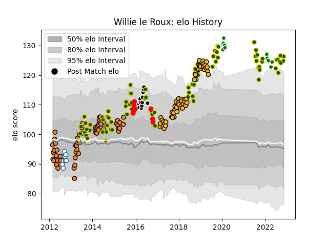

---  
layout: page  
title: Willie le Roux  
date: 2023-02-02 18:43:17.124286  
categories: player  
---
# Willie le Roux

## Positions: FB, W

## Country: South Africa

## Current elo: 99.0

## Current Percentile: 95.0

# Elo History

# Match History

| Team                  |   Appearances |   Win Rate |
|:----------------------|--------------:|-----------:|
| South Africa          |            84 |   0.660714 |
| Cheetahs              |            58 |   0.405172 |
| Wasps                 |            56 |   0.553571 |
| Toyota Verblitz       |            19 |   0.473684 |
| Sharks                |            13 |   0.576923 |
| Griquas               |             9 |   0.444444 |
| Yokohama Canon Eagles |             9 |   0.444444 |

| Opponent                          |   Matches |   Win Rate |
|:----------------------------------|----------:|-----------:|
| New Zealand                       |        15 |   0.3      |
| Argentina                         |        12 |   0.833333 |
| Australia                         |        11 |   0.545455 |
| Wales                             |         9 |   0.777778 |
| Bulls                             |         9 |   0.277778 |
| England                           |         8 |   0.625    |
| Sharks                            |         8 |   0.375    |
| Stormers                          |         7 |   0.428571 |
| Harlequins                        |         7 |   0.428571 |
| Scotland                          |         6 |   1        |
| Saracens                          |         6 |   0.166667 |
| Sale Sharks                       |         5 |   0.4      |
| Lions                             |         5 |   0.2      |
| Bath Rugby                        |         5 |   0.5      |
| Italy                             |         5 |   0.8      |
| Ireland                           |         5 |   0.4      |
| Hurricanes                        |         5 |   0.4      |
| Southern Kings                    |         4 |   1        |
| Saitama Wild Knights              |         4 |   0        |
| Western Force                     |         4 |   0.75     |
| Northampton Saints                |         4 |   1        |
| Worcester Warriors                |         4 |   1        |
| Leicester Tigers                  |         4 |   0.5      |
| Black Rams Tokyo                  |         4 |   0.5      |
| Blues                             |         4 |   0.5      |
| Gloucester Rugby                  |         4 |   0.625    |
| Brumbies                          |         4 |   0.25     |
| Chiefs                            |         4 |   0.125    |
| Crusaders                         |         4 |   0        |
| Highlanders                       |         3 |   0.666667 |
| Melbourne Rebels                  |         3 |   0.666667 |
| Toshiba Brave Lupus Tokyo         |         3 |   0.333333 |
| British and Irish Lions           |         3 |   0.666667 |
| Newcastle Falcons                 |         3 |   0.666667 |
| France                            |         3 |   0.666667 |
| New South Wales Waratahs          |         3 |   0.666667 |
| Exeter Chiefs                     |         3 |   0.666667 |
| Kobelco Kobe Steelers             |         3 |   0.333333 |
| Kubota Spears Funabashi Tokyo-Bay |         2 |   0.5      |
| Green Rockets Tokatsu             |         2 |   1        |
| Blue Bulls                        |         2 |   0.5      |
| Golden Lions                      |         2 |   1        |
| Ulster                            |         2 |   0.5      |
| Jaguares                          |         2 |   1        |
| Bristol Rugby                     |         2 |   1        |
| Stade Toulousain                  |         2 |   0        |
| Japan                             |         2 |   1        |
| Shizuoka Blue Revs                |         2 |   0        |
| London Irish                      |         2 |   1        |
| Samoa                             |         2 |   1        |
| NTT Docomo Red Hurricanes Osaka   |         2 |   1        |
| Natal Sharks                      |         2 |   0.5      |
| Queensland Reds                   |         2 |   0.5      |
| Free State Cheetahs               |         2 |   0        |
| Leinster                          |         2 |   0        |
| Toyota Industries Shuttles Aichi  |         1 |   1        |
| Western Province                  |         1 |   0        |
| United States of America          |         1 |   1        |
| Georgia                           |         1 |   1        |
| Canada                            |         1 |   1        |
| Tokyo Sungoliath                  |         1 |   0        |
| Hino Red Dolphins                 |         1 |   1        |
| La Rochelle                       |         1 |   1        |
| Coca-Cola Red Sparks              |         1 |   1        |
| Mie Honda Heat                    |         1 |   1        |
| Yokohama Canon Eagles             |         1 |   0        |