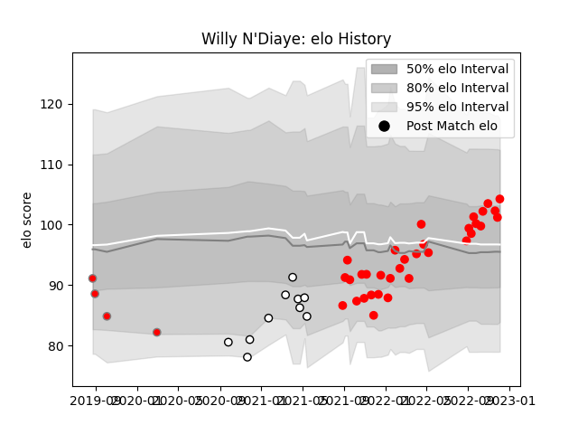

---  
layout: page  
title: Willy N'Diaye  
date: 2022-12-09 13:12:58.636312  
categories: player  
---
# Willy N'Diaye

## Positions: FL, N8

## Current elo: 104.0

## Current Percentile: 75.0

# Elo History

# Match History

| Team                       |   Appearances |   Win Rate |
|:---------------------------|--------------:|-----------:|
| Rouen                      |            33 |   0.469697 |
| Valence Romans Drome Rugby |            10 |   0.2      |
| Roval Drome XV             |             4 |   0        |

| Opponent           |   Matches |   Win Rate |
|:-------------------|----------:|-----------:|
| Vannes             |         6 |   0.666667 |
| Grenoble           |         5 |   0.2      |
| Montauban          |         4 |   0.25     |
| Beziers            |         4 |   0.25     |
| Colomiers          |         4 |   0.25     |
| Provence Rugby     |         3 |   0.333333 |
| Oyonnax            |         3 |   0.333333 |
| Nevers             |         3 |   0.333333 |
| US Bressane        |         2 |   0.25     |
| Agen               |         2 |   0.5      |
| Aurillac           |         2 |   0.5      |
| Carcassonne        |         2 |   0        |
| Mont-de-Marsan     |         2 |   0.5      |
| Narbonne           |         1 |   1        |
| Massy              |         1 |   1        |
| Biarritz Olympique |         1 |   1        |
| Soyaux-Angouleme   |         1 |   0        |
| Bayonne            |         1 |   0        |