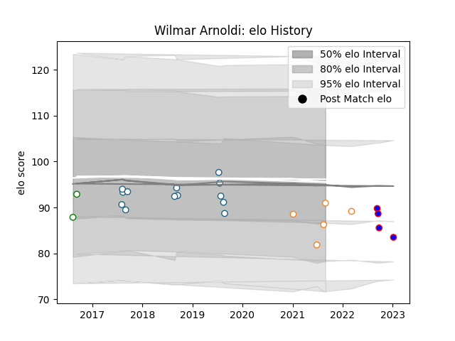

---  
layout: page  
title: Wilmar Arnoldi  
date: 2023-03-21 18:18:34.741595  
categories: player  
---
# Wilmar Arnoldi

Last updated: 2023-03-21
## Positions: H

## Current elo: 91.0

## Current Percentile: 28.0

# Elo History

# Match History

| Team                |   Appearances |   Win Rate |
|:--------------------|--------------:|-----------:|
| Griquas             |            14 |   0.5      |
| Cheetahs            |            10 |   0.3      |
| Free State Cheetahs |             5 |   0.2      |
| Beziers             |             3 |   0.333333 |
| Leopards            |             2 |   1        |
| Stormers            |             1 |   1        |

| Opponent            |   Matches |   Win Rate |
|:--------------------|----------:|-----------:|
| Natal Sharks        |         4 |   0.25     |
| Blue Bulls          |         3 |   0        |
| Western Province    |         3 |   0.666667 |
| Free State Cheetahs |         3 |   0.666667 |
| Golden Lions        |         3 |   0.333333 |
| Southern Kings      |         2 |   1        |
| Leinster            |         2 |   0.5      |
| Ospreys             |         1 |   1        |
| Ulster              |         1 |   0        |
| Soyaux-Angouleme    |         1 |   0        |
| Scarlets            |         1 |   0        |
| SWD Eagles          |         1 |   1        |
| Pumas               |         1 |   1        |
| Montauban           |         1 |   1        |
| Border Bulldogs     |         1 |   1        |
| Griquas             |         1 |   0        |
| Griffons            |         1 |   1        |
| Dragons             |         1 |   0        |
| Connacht            |         1 |   0        |
| Cardiff Blues       |         1 |   0        |
| Carcassonne         |         1 |   0        |
| Zebre               |         1 |   0        |