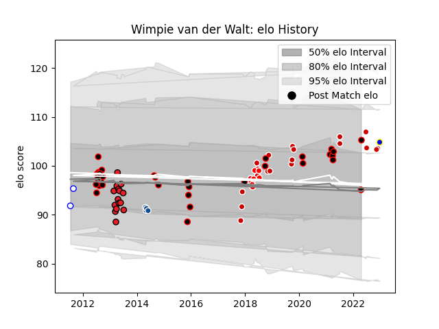

---  
layout: page  
title: Wimpie van der Walt  
date: 2022-11-16 11:29:19.704006  
categories: player  
---
# Wimpie van der Walt

## Positions: FL, L

## Country: Japan

## Current elo: 102.0

## Current Percentile: 75.0

# Elo History

# Match History

| Team                            |   Appearances |   Win Rate |
|:--------------------------------|--------------:|-----------:|
| Japan                           |            18 |   0.472222 |
| Southern Kings                  |            15 |   0.233333 |
| NTT Docomo Red Hurricanes Osaka |            14 |   0.5      |
| Eastern Province Kings          |            10 |   0.9      |
| Sunwolves                       |             9 |   0.111111 |
| Bulls                           |             4 |   0.5      |
| Western Province                |             1 |   0.5      |

| Opponent                         |   Matches |   Win Rate |
|:---------------------------------|----------:|-----------:|
| New South Wales Waratahs         |         3 |   0        |
| Cheetahs                         |         3 |   0.333333 |
| Stormers                         |         3 |   0.333333 |
| Leopards                         |         2 |   1        |
| Shizuoka Blue Revs               |         2 |   0        |
| Russia                           |         2 |   1        |
| SWD Eagles                       |         2 |   1        |
| Lions                            |         2 |   0        |
| Saitama Wild Knights             |         2 |   0        |
| Kobelco Kobe Steelers            |         2 |   0.5      |
| Italy                            |         2 |   0.5      |
| Ireland                          |         2 |   0.5      |
| Hurricanes                       |         2 |   0        |
| Sharks                           |         2 |   0        |
| Griffons                         |         2 |   1        |
| Pumas                            |         2 |   0.5      |
| France                           |         2 |   0.25     |
| England                          |         2 |   0        |
| Chiefs                           |         2 |   0        |
| Bulls                            |         2 |   0        |
| Western Force                    |         2 |   0.5      |
| Queensland Reds                  |         2 |   0.5      |
| South Africa                     |         1 |   0        |
| Tonga                            |         1 |   1        |
| Toshiba Brave Lupus Tokyo        |         1 |   0        |
| Samoa                            |         1 |   1        |
| Toyota Industries Shuttles Aichi |         1 |   0        |
| Uruguay                          |         1 |   1        |
| Valke                            |         1 |   1        |
| Australia                        |         1 |   0        |
| New Zealand                      |         1 |   0        |
| Melbourne Rebels                 |         1 |   1        |
| Mazda Blue Zoomers               |         1 |   1        |
| Blues                            |         1 |   0        |
| Kamaishi Seawaves                |         1 |   1        |
| Hino Red Dolphins                |         1 |   1        |
| Highlanders                      |         1 |   1        |
| Griquas                          |         1 |   0.5      |
| Green Rockets Tokatsu            |         1 |   1        |
| Georgia                          |         1 |   1        |
| Crusaders                        |         1 |   0        |
| Coca-Cola Red Sparks             |         1 |   1        |
| Brumbies                         |         1 |   0.5      |
| British and Irish Lions          |         1 |   0        |
| Border Bulldogs                  |         1 |   1        |
| Yokohama Canon Eagles            |         1 |   1        |