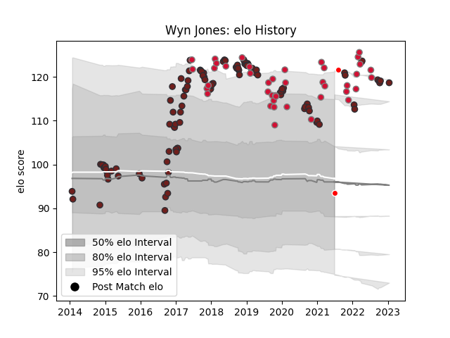

---  
layout: page  
title: Wyn Jones  
date: 2023-03-21 18:31:51.051720  
categories: player  
---
# Wyn Jones

Last updated: 2023-03-21
## Positions: P

## Country: Wales

## Current elo: 93.0

## Current Percentile: 92.0

# Elo History

# Match History

| Team                    |   Appearances |   Win Rate |
|:------------------------|--------------:|-----------:|
| Scarlets                |           113 |   0.566372 |
| Wales                   |            44 |   0.545455 |
| British and Irish Lions |             2 |   0.5      |

| Opponent           |   Matches |   Win Rate |
|:-------------------|----------:|-----------:|
| Cardiff Blues      |        14 |   0.571429 |
| Ospreys            |        11 |   0.681818 |
| Dragons            |         9 |   0.777778 |
| Benetton Treviso   |         7 |   0.857143 |
| Toulon             |         7 |   0.285714 |
| Glasgow Warriors   |         7 |   0.428571 |
| South Africa       |         7 |   0.428571 |
| Munster            |         6 |   0.5      |
| Leinster           |         6 |   0.5      |
| France             |         6 |   0.333333 |
| Ulster             |         6 |   0.333333 |
| Italy              |         5 |   0.8      |
| Ireland            |         5 |   0.2      |
| England            |         5 |   0.4      |
| Zebre              |         5 |   1        |
| Scotland           |         5 |   0.6      |
| Connacht           |         4 |   0.5      |
| Edinburgh          |         4 |   0.5      |
| Cheetahs           |         3 |   1        |
| Racing 92          |         3 |   0        |
| Bath Rugby         |         3 |   0.666667 |
| Leicester Tigers   |         3 |   0.333333 |
| London Irish       |         3 |   0.666667 |
| New Zealand        |         3 |   0        |
| Sale Sharks        |         3 |   0.333333 |
| Saracens           |         2 |   0.25     |
| Tonga              |         2 |   1        |
| Australia          |         2 |   1        |
| Georgia            |         2 |   1        |
| Bayonne            |         2 |   1        |
| Northampton Saints |         1 |   0        |
| Samoa              |         1 |   1        |
| Gloucester Rugby   |         1 |   1        |
| Fiji               |         1 |   1        |
| Southern Kings     |         1 |   1        |
| Bristol Rugby      |         1 |   0        |
| Bordeaux Begles    |         1 |   0        |
| Uruguay            |         1 |   1        |
| Japan              |         1 |   1        |