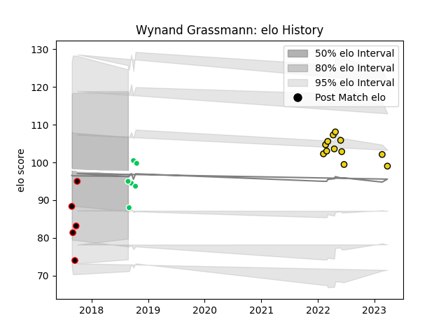

---  
layout: page  
title: Wynand Grassmann  
date: 2023-03-29 11:30:57.488389  
categories: player  
---
# Wynand Grassmann

Last updated: 2023-03-29
## Positions: L, FL

## Current elo: 95.0

## Current Percentile: 16.0

# Elo History

# Match History

| Team                   |   Appearances |   Win Rate |
|:-----------------------|--------------:|-----------:|
| Houston SaberCats      |            12 |   0.5      |
| SWD Eagles             |             6 |   0.833333 |
| Eastern Province Kings |             5 |   0        |

| Opponent            |   Matches |   Win Rate |
|:--------------------|----------:|-----------:|
| Dallas Jackals      |         3 |   1        |
| Valke               |         3 |   0.666667 |
| Boland Cavaliers    |         2 |   0.5      |
| Border Bulldogs     |         2 |   0.5      |
| Griffons            |         2 |   0.5      |
| L. A. Giltinis      |         2 |   0.5      |
| Rugby ATL           |         2 |   0.5      |
| Seattle Seawolves   |         2 |   0        |
| Austin Gilgronis    |         1 |   0        |
| Leopards            |         1 |   0        |
| Namibia Welwitchias |         1 |   0        |
| San Diego Legion    |         1 |   0        |
| Toronto Arrows      |         1 |   1        |