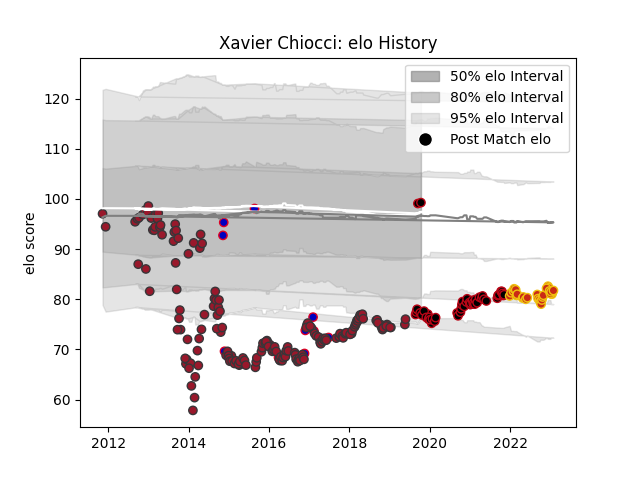

---  
layout: page  
title: Xavier Chiocci  
date: 2023-02-02 18:58:06.953174  
categories: player  
---
# Xavier Chiocci

## Positions: P

## Country: France

## Current elo: 99.0

## Current Percentile: 6.0

# Elo History

# Match History

| Team      |   Appearances |   Win Rate |
|:----------|--------------:|-----------:|
| Toulon    |           176 |   0.616477 |
| Lyon      |            50 |   0.59     |
| Perpignan |            28 |   0.357143 |
| France    |            10 |   0.3      |

| Opponent             |   Matches |   Win Rate |
|:---------------------|----------:|-----------:|
| Castres Olympique    |        20 |   0.55     |
| Clermont Auvergne    |        20 |   0.425    |
| Stade Francais Paris |        18 |   0.5      |
| Montpellier Herault  |        16 |   0.59375  |
| Bordeaux Begles      |        15 |   0.666667 |
| Stade Toulousain     |        13 |   0.615385 |
| Racing 92            |        13 |   0.307692 |
| La Rochelle          |        13 |   0.576923 |
| Brive                |        12 |   0.5      |
| Bayonne              |        10 |   0.7      |
| Pau                  |        10 |   0.45     |
| Grenoble             |         9 |   0.555556 |
| Agen                 |         8 |   0.875    |
| Oyonnax              |         7 |   0.714286 |
| Lyon                 |         7 |   0.571429 |
| Biarritz Olympique   |         6 |   1        |
| Toulon               |         6 |   0.666667 |
| Leinster             |         5 |   0.8      |
| Scarlets             |         5 |   0.6      |
| Glasgow Warriors     |         4 |   0.5      |
| Benetton Treviso     |         4 |   0.75     |
| Perpignan            |         4 |   1        |
| Wasps                |         3 |   0.666667 |
| England              |         3 |   0        |
| Bath Rugby           |         3 |   1        |
| Saracens             |         3 |   0.333333 |
| Australia            |         2 |   0.5      |
| Sale Sharks          |         2 |   1        |
| Exeter Chiefs        |         2 |   1        |
| Newcastle Falcons    |         2 |   0        |
| Munster              |         2 |   0.5      |
| Cardiff Blues        |         2 |   0.5      |
| Mont-de-Marsan       |         2 |   1        |
| Edinburgh            |         2 |   0        |
| Bristol Rugby        |         2 |   0        |
| Fiji                 |         1 |   1        |
| Northampton Saints   |         1 |   0        |
| Petrarca Padova      |         1 |   1        |
| New Zealand          |         1 |   0        |
| Scotland             |         1 |   1        |
| South Africa         |         1 |   0        |
| Argentina            |         1 |   0        |
| Leicester Tigers     |         1 |   0        |
| Ulster               |         1 |   1        |