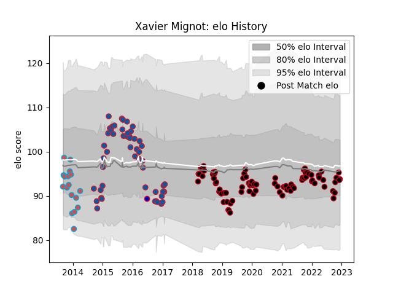

---  
layout: page  
title: Xavier Mignot  
date: 2023-02-02 19:01:34.564788  
categories: player  
---
# Xavier Mignot

## Positions: W, C

## Country: France

## Current elo: 96.0

## Current Percentile: 36.0

# Elo History

# Match History

| Team             |   Appearances |   Win Rate |
|:-----------------|--------------:|-----------:|
| Lyon             |            87 |   0.54023  |
| Grenoble         |            52 |   0.384615 |
| Bourgoin-Jallieu |            18 |   0.472222 |
| France           |             1 |   0        |

| Opponent             |   Matches |   Win Rate |
|:---------------------|----------:|-----------:|
| Racing 92            |        12 |   0.416667 |
| La Rochelle          |        12 |   0.208333 |
| Toulon               |        11 |   0.409091 |
| Stade Francais Paris |        11 |   0.636364 |
| Montpellier Herault  |        11 |   0.636364 |
| Stade Toulousain     |        10 |   0.6      |
| Bordeaux Begles      |         8 |   0.375    |
| Pau                  |         8 |   0.8125   |
| Clermont Auvergne    |         7 |   0.428571 |
| Agen                 |         6 |   0.833333 |
| Castres Olympique    |         5 |   0.4      |
| Bayonne              |         5 |   0.6      |
| Lyon                 |         5 |   0.2      |
| Oyonnax              |         4 |   0.5      |
| Brive                |         4 |   0.75     |
| Cardiff Blues        |         3 |   0        |
| Perpignan            |         3 |   0.666667 |
| London Irish         |         3 |   0.333333 |
| Rovigo               |         2 |   1        |
| Saracens             |         2 |   0        |
| Leinster             |         2 |   0        |
| US Bressane          |         2 |   0.5      |
| Colomiers            |         2 |   0        |
| Edinburgh            |         2 |   0.5      |
| Benetton Treviso     |         2 |   0.5      |
| Carcassonne          |         1 |   1        |
| Argentina            |         1 |   0        |
| Auch                 |         1 |   1        |
| Aurillac             |         1 |   1        |
| Beziers              |         1 |   1        |
| Biarritz Olympique   |         1 |   1        |
| Bulls                |         1 |   0        |
| Albi                 |         1 |   0        |
| Grenoble             |         1 |   1        |
| Ospreys              |         1 |   0        |
| Northampton Saints   |         1 |   0        |
| Newcastle Falcons    |         1 |   1        |
| Narbonne             |         1 |   0        |
| Mont-de-Marsan       |         1 |   0        |
| Glasgow Warriors     |         1 |   0        |
| Harlequins           |         1 |   0        |