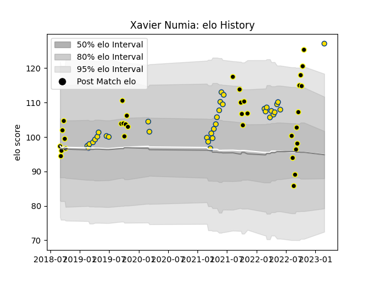

---  
layout: page  
title: Xavier Numia  
date: 2023-03-02 11:23:14.199095  
categories: player  
---
# Xavier Numia

## Positions: P

## Current elo: 127.0

## Current Percentile: 97.0

# Elo History

# Match History

| Team       |   Appearances |   Win Rate |
|:-----------|--------------:|-----------:|
| Hurricanes |            35 |   0.6      |
| Wellington |            34 |   0.676471 |

| Opponent                 |   Matches |   Win Rate |
|:-------------------------|----------:|-----------:|
| Blues                    |         5 |   0.4      |
| Crusaders                |         5 |   0        |
| Highlanders              |         5 |   1        |
| Canterbury               |         4 |   0.75     |
| Chiefs                   |         4 |   0.25     |
| Tasman                   |         4 |   0.25     |
| Auckland                 |         3 |   0.666667 |
| Northland                |         3 |   0.666667 |
| Waikato                  |         3 |   0.666667 |
| Hawke's Bay              |         3 |   0.666667 |
| Queensland Reds          |         3 |   1        |
| New South Wales Waratahs |         3 |   1        |
| Taranaki                 |         2 |   0.5      |
| Sunwolves                |         2 |   1        |
| Southland                |         2 |   1        |
| Otago                    |         2 |   1        |
| Western Force            |         2 |   0.5      |
| North Harbour            |         2 |   0.5      |
| Bay of Plenty            |         2 |   0.5      |
| Manawatu                 |         2 |   1        |
| Counties Manukau         |         2 |   1        |
| Brumbies                 |         2 |   0.5      |
| Melbourne Rebels         |         1 |   1        |
| Stormers                 |         1 |   1        |
| Fijian Drua              |         1 |   1        |
| Moana Pasifika           |         1 |   0        |