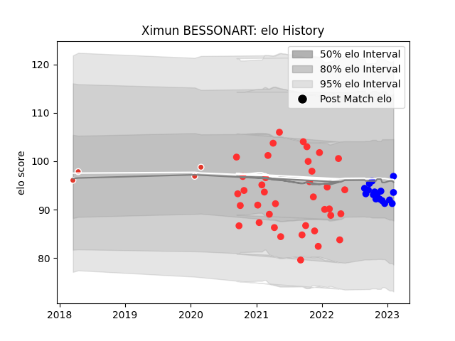

---  
layout: page  
title: Ximun BESSONART  
date: 2023-02-16 16:41:01.324620  
categories: player  
---
# Ximun BESSONART

## Positions: P

## Current elo: 97.0

## Current Percentile: 42.0

# Elo History

# Match History

| Team               |   Appearances |   Win Rate |
|:-------------------|--------------:|-----------:|
| Tarbes             |            38 |   0.513158 |
| Vannes             |            18 |   0.527778 |
| Biarritz Olympique |             4 |   0.625    |

| Opponent                   |   Matches |   Win Rate |
|:---------------------------|----------:|-----------:|
| Massy                      |         5 |   0.4      |
| Bourgoin-Jallieu           |         4 |   0.75     |
| Dijon                      |         3 |   0.5      |
| Montauban                  |         3 |   0.833333 |
| Aubenas                    |         3 |   0.666667 |
| Suresnes                   |         3 |   0.333333 |
| Biarritz Olympique         |         3 |   0.333333 |
| Cognac Saint Jean d'Angély |         3 |   0.833333 |
| Dax                        |         3 |   0.666667 |
| Albi                       |         3 |   0.666667 |
| US Bressane                |         2 |   0.5      |
| Soyaux-Angouleme           |         2 |   0.5      |
| Oyonnax                    |         2 |   0        |
| Nice                       |         2 |   0.25     |
| Nevers                     |         2 |   0.5      |
| Narbonne                   |         2 |   0        |
| Agen                       |         2 |   0        |
| Grenoble                   |         2 |   0.75     |
| Blagnac                    |         2 |   0.5      |
| Valence Romans Drome Rugby |         2 |   0.5      |
| Mont-de-Marsan             |         1 |   0        |
| Colomiers                  |         1 |   1        |
| Chambery                   |         1 |   0        |
| Carcassonne                |         1 |   1        |
| Provence Rugby             |         1 |   1        |
| Beziers                    |         1 |   1        |
| Aurillac                   |         1 |   1        |