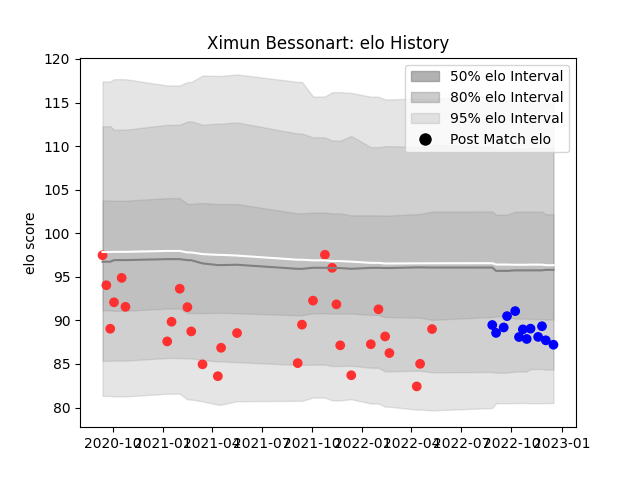

---  
layout: page  
title: Ximun Bessonart  
date: 2022-12-18 16:33:45.887090  
categories: player  
---
# Ximun Bessonart

## Positions: P

## Current elo: 87.0

## Current Percentile: 18.0

# Elo History

# Match History

| Team   |   Appearances |   Win Rate |
|:-------|--------------:|-----------:|
| Tarbes |            30 |   0.55     |
| Vannes |            13 |   0.653846 |

| Opponent                   |   Matches |   Win Rate |
|:---------------------------|----------:|-----------:|
| Bourgoin-Jallieu           |         4 |   0.75     |
| Massy                      |         4 |   0.5      |
| Dax                        |         3 |   0.666667 |
| Dijon                      |         3 |   0.5      |
| Valence Romans Drome Rugby |         2 |   0.5      |
| US Bressane                |         2 |   0.5      |
| Suresnes                   |         2 |   0.5      |
| Soyaux-Angouleme           |         2 |   0.5      |
| Cognac Saint Jean d'Angély |         2 |   0.75     |
| Albi                       |         2 |   1        |
| Narbonne                   |         2 |   0        |
| Montauban                  |         1 |   0.5      |
| Provence Rugby             |         1 |   1        |
| Oyonnax                    |         1 |   0        |
| Nice                       |         1 |   0.5      |
| Nevers                     |         1 |   1        |
| Agen                       |         1 |   0        |
| Mont-de-Marsan             |         1 |   0        |
| Colomiers                  |         1 |   1        |
| Chambery                   |         1 |   0        |
| Carcassonne                |         1 |   1        |
| Blagnac                    |         1 |   0        |
| Biarritz Olympique         |         1 |   1        |
| Beziers                    |         1 |   1        |
| Aubenas                    |         1 |   1        |
| Grenoble                   |         1 |   1        |