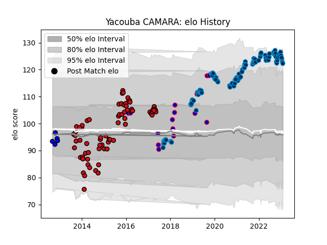

---  
layout: page  
title: Yacouba CAMARA  
date: 2023-01-17 11:41:54.963504  
categories: player  
---
# Yacouba CAMARA

## Positions: FL

## Country: France

## Current elo: 121.0

## Current Percentile: 93.0

# Elo History

# Match History

| Team                |   Appearances |   Win Rate |
|:--------------------|--------------:|-----------:|
| Montpellier Herault |            91 |   0.516484 |
| Stade Toulousain    |            71 |   0.514085 |
| France              |            17 |   0.470588 |
| Massy               |             5 |   0        |

| Opponent                 |   Matches |   Win Rate |
|:-------------------------|----------:|-----------:|
| Toulon                   |        12 |   0.625    |
| Racing 92                |        12 |   0.333333 |
| Bordeaux Begles          |        11 |   0.363636 |
| Castres Olympique        |        11 |   0.545455 |
| Clermont Auvergne        |        11 |   0.363636 |
| Stade Francais Paris     |        11 |   0.818182 |
| Lyon                     |        10 |   0.5      |
| La Rochelle              |        10 |   0.4      |
| Brive                    |         9 |   0.611111 |
| Pau                      |         9 |   0.555556 |
| Bayonne                  |         8 |   0.625    |
| Grenoble                 |         6 |   0.5      |
| Oyonnax                  |         6 |   0.75     |
| Montpellier Herault      |         6 |   0.5      |
| Stade Toulousain         |         6 |   0.166667 |
| Italy                    |         4 |   1        |
| Saracens                 |         3 |   0.333333 |
| Scotland                 |         3 |   0        |
| Perpignan                |         3 |   0.666667 |
| South Africa             |         3 |   0        |
| Agen                     |         3 |   1        |
| Biarritz Olympique       |         3 |   1        |
| Connacht                 |         3 |   0.333333 |
| Munster                  |         2 |   0        |
| Exeter Chiefs            |         2 |   0        |
| Ulster                   |         2 |   0        |
| England                  |         2 |   0.5      |
| Ireland                  |         2 |   0.5      |
| Leinster                 |         2 |   0        |
| Gloucester Rugby         |         1 |   1        |
| Ospreys                  |         1 |   0        |
| Edinburgh                |         1 |   0        |
| Tonga                    |         1 |   1        |
| London Irish             |         1 |   1        |
| Auch                     |         1 |   0        |
| United States of America |         1 |   1        |
| Wales                    |         1 |   0        |
| Zebre                    |         1 |   1        |