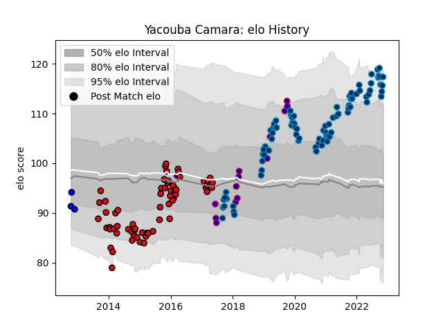

---  
layout: page  
title: Yacouba Camara  
date: 2022-12-09 13:20:46.644524  
categories: player  
---
# Yacouba Camara

## Positions: FL

## Country: France

## Current elo: 117.0

## Current Percentile: 95.0

# Elo History

# Match History

| Team                |   Appearances |   Win Rate |
|:--------------------|--------------:|-----------:|
| Montpellier Herault |            86 |   0.511628 |
| Stade Toulousain    |            64 |   0.507812 |
| France              |            16 |   0.5      |
| Massy               |             3 |   0        |

| Opponent                 |   Matches |   Win Rate |
|:-------------------------|----------:|-----------:|
| Racing 92                |        11 |   0.272727 |
| Toulon                   |        11 |   0.681818 |
| Lyon                     |        10 |   0.5      |
| Castres Olympique        |        10 |   0.5      |
| Clermont Auvergne        |        10 |   0.3      |
| Stade Francais Paris     |        10 |   0.8      |
| Bordeaux Begles          |         9 |   0.444444 |
| Brive                    |         9 |   0.611111 |
| La Rochelle              |         9 |   0.444444 |
| Pau                      |         9 |   0.555556 |
| Bayonne                  |         7 |   0.714286 |
| Montpellier Herault      |         6 |   0.5      |
| Stade Toulousain         |         6 |   0.166667 |
| Oyonnax                  |         6 |   0.75     |
| Grenoble                 |         5 |   0.4      |
| Italy                    |         4 |   1        |
| Saracens                 |         3 |   0.333333 |
| South Africa             |         3 |   0        |
| Agen                     |         3 |   1        |
| Connacht                 |         3 |   0.333333 |
| Biarritz Olympique       |         3 |   1        |
| Munster                  |         2 |   0        |
| Leinster                 |         2 |   0        |
| Ireland                  |         2 |   0.5      |
| Perpignan                |         2 |   0.5      |
| Exeter Chiefs            |         2 |   0        |
| Scotland                 |         2 |   0        |
| England                  |         2 |   0.5      |
| Ulster                   |         2 |   0        |
| Gloucester Rugby         |         1 |   1        |
| Edinburgh                |         1 |   0        |
| Tonga                    |         1 |   1        |
| United States of America |         1 |   1        |
| Wales                    |         1 |   0        |
| Zebre                    |         1 |   1        |