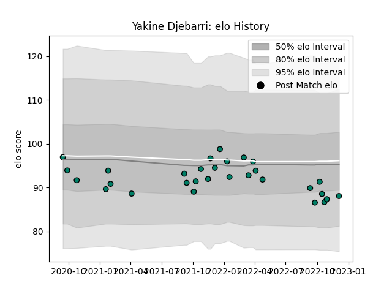

---  
layout: page  
title: Yakine Djebarri  
date: 2023-02-02 18:47:45.659259  
categories: player  
---
# Yakine Djebarri

## Positions: L

## Current elo: 94.0

## Current Percentile: 51.0

# Elo History

# Match History

| Team     |   Appearances |   Win Rate |
|:---------|--------------:|-----------:|
| Suresnes |            41 |   0.512195 |

| Opponent                   |   Matches |   Win Rate |
|:---------------------------|----------:|-----------:|
| Cognac Saint Jean d'Angély |         5 |   0.6      |
| Blagnac                    |         4 |   0.5      |
| Dax                        |         4 |   0.5      |
| Albi                       |         3 |   0.666667 |
| Bourgoin-Jallieu           |         3 |   0.666667 |
| Nice                       |         3 |   0.333333 |
| Narbonne                   |         3 |   0.333333 |
| Massy                      |         2 |   0        |
| Tarbes                     |         2 |   1        |
| Dijon                      |         2 |   1        |
| Aubenas                    |         2 |   1        |
| Carqueiranne-Hyères        |         2 |   0.5      |
| Valence Romans Drome Rugby |         2 |   0        |
| Chambery                   |         1 |   0        |
| Rennes                     |         1 |   1        |
| Soyaux-Angouleme           |         1 |   0        |
| US Bressane                |         1 |   0        |