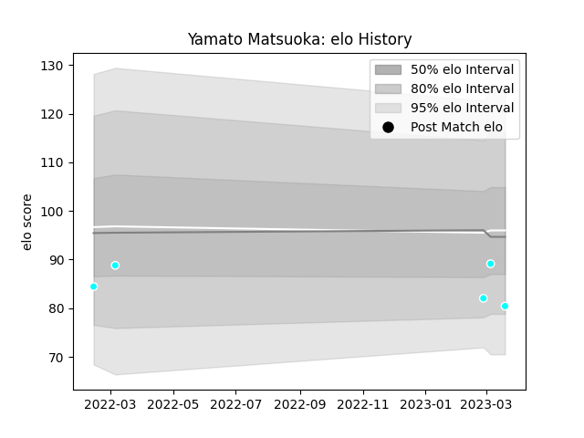

---  
layout: page  
title: Yamato Matsuoka  
date: 2023-03-21 18:22:42.843014  
categories: player  
---
# Yamato Matsuoka

Last updated: 2023-03-21
## Positions: FL, N8

## Current elo: 80.0

## Current Percentile: 30.0

# Elo History

# Match History

| Team                             |   Appearances |   Win Rate |
|:---------------------------------|--------------:|-----------:|
| Toyota Industries Shuttles Aichi |             5 |        0.6 |

| Opponent              |   Matches |   Win Rate |
|:----------------------|----------:|-----------:|
| Chugoku Red Regulions |         1 |          1 |
| Kamaishi Seawaves     |         1 |          1 |
| Kyuden Voltex         |         1 |          1 |
| Mie Honda Heat        |         1 |          0 |
| Urayasu D-Rocks       |         1 |          0 |