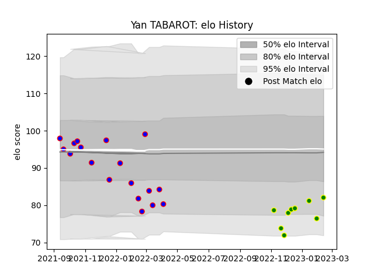

---  
layout: page  
title: Yan TABAROT  
date: 2023-03-16 11:29:43.739933  
categories: player  
---
# Yan TABAROT

## Positions: H

## Current elo: 72.0

## Current Percentile: 9.0

# Elo History

# Match History

| Team                |   Appearances |   Win Rate |
|:--------------------|--------------:|-----------:|
| Dijon               |            18 |   0.388889 |
| Carqueiranne-Hyères |            13 |   0.230769 |

| Opponent                   |   Matches |   Win Rate |
|:---------------------------|----------:|-----------:|
| Chambery                   |         3 |   0        |
| Dax                        |         3 |   0.333333 |
| Nice                       |         3 |   0.333333 |
| Tarbes                     |         3 |   0.166667 |
| Aubenas                    |         2 |   0.75     |
| Blagnac                    |         2 |   0        |
| Bourgoin-Jallieu           |         2 |   0.5      |
| Cognac Saint Jean d'Angély |         2 |   0.5      |
| Massy                      |         2 |   0        |
| Soyaux-Angouleme           |         2 |   0.5      |
| Valence Romans Drome Rugby |         2 |   0.5      |
| Albi                       |         1 |   0        |
| Narbonne                   |         1 |   0        |
| Rennes                     |         1 |   0        |
| Suresnes                   |         1 |   1        |
| US Bressane                |         1 |   1        |