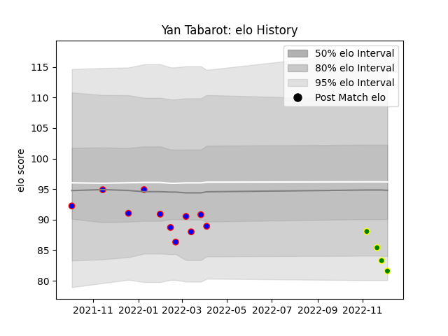

---  
layout: page  
title: Yan Tabarot  
date: 2022-12-14 11:32:49.457688  
categories: player  
---
# Yan Tabarot

## Positions: H

## Current elo: 82.0

## Current Percentile: 6.0

# Elo History

# Match History

| Team                |   Appearances |   Win Rate |
|:--------------------|--------------:|-----------:|
| Dijon               |            11 |   0.318182 |
| Carqueiranne-Hyères |             5 |   0        |

| Opponent                   |   Matches |   Win Rate |
|:---------------------------|----------:|-----------:|
| Dax                        |         3 |   0.333333 |
| Blagnac                    |         2 |   0        |
| Nice                       |         2 |   0.5      |
| Tarbes                     |         2 |   0.25     |
| Albi                       |         1 |   0        |
| Aubenas                    |         1 |   1        |
| Chambery                   |         1 |   0        |
| Cognac Saint Jean d'Angély |         1 |   0        |
| Narbonne                   |         1 |   0        |
| Rennes                     |         1 |   0        |
| Soyaux-Angouleme           |         1 |   0        |