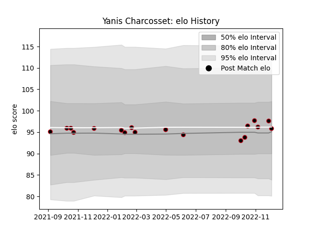

---  
layout: page  
title: Yanis Charcosset  
date: 2023-01-06 00:12:41.039462  
categories: player  
---
# Yanis Charcosset

## Positions: H

## Current elo: 106.0

## Current Percentile: 69.0

# Elo History

# Match History

| Team   |   Appearances |   Win Rate |
|:-------|--------------:|-----------:|
| Lyon   |            21 |   0.571429 |

| Opponent             |   Matches |   Win Rate |
|:---------------------|----------:|-----------:|
| Biarritz Olympique   |         2 |        1   |
| Brive                |         2 |        0.5 |
| Castres Olympique    |         2 |        0.5 |
| Clermont Auvergne    |         2 |        0.5 |
| Montpellier Herault  |         2 |        1   |
| Perpignan            |         2 |        0.5 |
| Stade Francais Paris |         2 |        0.5 |
| Stade Toulousain     |         2 |        1   |
| Bayonne              |         1 |        0   |
| Bordeaux Begles      |         1 |        1   |
| La Rochelle          |         1 |        0   |
| Saracens             |         1 |        0   |
| Toulon               |         1 |        0   |