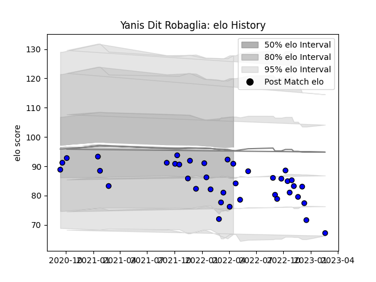

---  
layout: page  
title: Yanis Dit Robaglia  
date: 2022-12-09 13:24:32.930428  
categories: player  
---
# Yanis Dit Robaglia

## Positions: W

## Current elo: 89.0

## Current Percentile: 14.0

# Elo History

# Match History

| Team   |   Appearances |   Win Rate |
|:-------|--------------:|-----------:|
| Massy  |            28 |   0.589286 |

| Opponent                   |   Matches |   Win Rate |
|:---------------------------|----------:|-----------:|
| Bourgoin-Jallieu           |         3 |       1    |
| Tarbes                     |         2 |       0.5  |
| Suresnes                   |         2 |       1    |
| Chambery                   |         2 |       0.25 |
| Dijon                      |         2 |       1    |
| Agen                       |         1 |       0    |
| Nevers                     |         1 |       0    |
| Valence Romans Drome Rugby |         1 |       1    |
| Rouen                      |         1 |       0    |
| Provence Rugby             |         1 |       1    |
| Oyonnax                    |         1 |       0    |
| Nice                       |         1 |       0    |
| Mont-de-Marsan             |         1 |       1    |
| Montauban                  |         1 |       0    |
| Albi                       |         1 |       1    |
| Dax                        |         1 |       1    |
| Cognac Saint Jean d'Angély |         1 |       1    |
| Carcassonne                |         1 |       1    |
| Biarritz Olympique         |         1 |       0    |
| Beziers                    |         1 |       0    |
| Aubenas                    |         1 |       1    |
| Vannes                     |         1 |       0    |