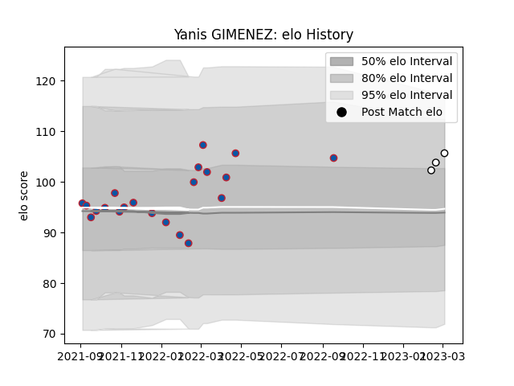

---  
layout: page  
title: Yanis GIMENEZ  
date: 2023-03-29 11:29:58.300849  
categories: player  
---
# Yanis GIMENEZ

Last updated: 2023-03-29
## Positions: H

## Current elo: 110.0

## Current Percentile: 81.0

# Elo History

# Match History

| Team                       |   Appearances |   Win Rate |
|:---------------------------|--------------:|-----------:|
| Grenoble                   |            21 |   0.404762 |
| Valence Romans Drome Rugby |             5 |   0.8      |

| Opponent         |   Matches |   Win Rate |
|:-----------------|----------:|-----------:|
| Rouen            |         3 |   0.666667 |
| Agen             |         2 |   0.5      |
| Aurillac         |         2 |   0.5      |
| Carcassonne      |         2 |   0.5      |
| Colomiers        |         2 |   0        |
| Provence Rugby   |         2 |   0        |
| Nevers           |         2 |   0.75     |
| Nice             |         1 |   0        |
| US Bressane      |         1 |   0        |
| Suresnes         |         1 |   1        |
| Oyonnax          |         1 |   0        |
| Narbonne         |         1 |   1        |
| Albi             |         1 |   1        |
| Montauban        |         1 |   1        |
| Bourgoin-Jallieu |         1 |   1        |
| Beziers          |         1 |   0        |
| Bayonne          |         1 |   0        |
| Vannes           |         1 |   1        |