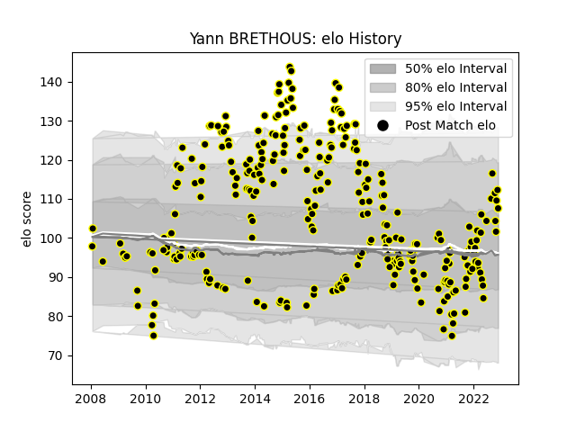

---  
layout: page  
title: Yann BRETHOUS  
date: 2023-02-02 15:49:42.477382  
categories: player  
---
# Yann BRETHOUS

## Positions: FL

## Current elo: 111.0

## Current Percentile: 74.0

# Elo History

# Match History

| Team           |   Appearances |   Win Rate |
|:---------------|--------------:|-----------:|
| Mont-de-Marsan |           292 |   0.544521 |

| Opponent                   |   Matches |   Win Rate |
|:---------------------------|----------:|-----------:|
| Aurillac                   |        21 |   0.761905 |
| Colomiers                  |        18 |   0.444444 |
| Beziers                    |        16 |   0.6875   |
| Biarritz Olympique         |        14 |   0.464286 |
| Carcassonne                |        14 |   0.714286 |
| Montauban                  |        13 |   0.538462 |
| Oyonnax                    |        13 |   0.5      |
| Narbonne                   |        12 |   0.75     |
| Dax                        |        12 |   0.583333 |
| Perpignan                  |        12 |   0.416667 |
| Provence Rugby             |        10 |   0.5      |
| Vannes                     |        10 |   0.5      |
| Tarbes                     |        10 |   0.5      |
| Albi                       |         8 |   0.875    |
| Bourgoin-Jallieu           |         8 |   0.625    |
| Soyaux-Angouleme           |         8 |   0.375    |
| Bayonne                    |         8 |   0.5625   |
| Nevers                     |         7 |   0.285714 |
| Rouen                      |         7 |   0.857143 |
| Agen                       |         7 |   0.285714 |
| Grenoble                   |         7 |   0.571429 |
| Lyon                       |         6 |   0        |
| Pau                        |         6 |   0.583333 |
| Massy                      |         6 |   0.5      |
| US Bressane                |         5 |   0.7      |
| Auch                       |         5 |   0.6      |
| Bordeaux Begles            |         5 |   0.8      |
| La Rochelle                |         2 |   0.5      |
| Saint-Etienne              |         2 |   1        |
| Valence Romans Drome Rugby |         2 |   0.75     |
| Montpellier Herault        |         2 |   0        |
| Brive                      |         2 |   0.5      |
| London Irish               |         2 |   0        |
| Racing 92                  |         2 |   0.5      |
| Castres Olympique          |         2 |   0        |
| Gloucester Rugby           |         2 |   0        |
| Stade Francais Paris       |         1 |   0        |
| Stade Toulousain           |         1 |   0        |
| Clermont Auvergne          |         1 |   0        |
| Toulon                     |         1 |   0        |
| Lannemezan                 |         1 |   1        |
| Saracens                   |         1 |   0        |