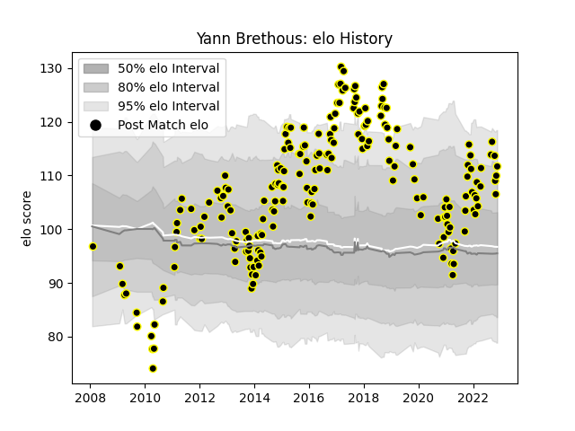

---  
layout: page  
title: Yann Brethous  
date: 2022-11-22 11:39:36.146100  
categories: player  
---
# Yann Brethous

## Positions: FL

## Current elo: 112.0

## Current Percentile: 87.0

# Elo History

# Match History

| Team           |   Appearances |   Win Rate |
|:---------------|--------------:|-----------:|
| Mont-de-Marsan |           202 |   0.514851 |

| Opponent                   |   Matches |   Win Rate |
|:---------------------------|----------:|-----------:|
| Aurillac                   |        12 |   0.833333 |
| Beziers                    |        12 |   0.625    |
| Biarritz Olympique         |        11 |   0.590909 |
| Carcassonne                |        11 |   0.636364 |
| Montauban                  |        11 |   0.545455 |
| Narbonne                   |        10 |   0.7      |
| Vannes                     |         9 |   0.555556 |
| Tarbes                     |         9 |   0.444444 |
| Perpignan                  |         9 |   0.222222 |
| Colomiers                  |         9 |   0.5      |
| Dax                        |         9 |   0.555556 |
| Oyonnax                    |         8 |   0.6875   |
| Lyon                       |         6 |   0        |
| Rouen                      |         6 |   0.833333 |
| Provence Rugby             |         6 |   0.5      |
| Agen                       |         6 |   0.166667 |
| Bourgoin-Jallieu           |         6 |   0.5      |
| Soyaux-Angouleme           |         5 |   0.2      |
| Bayonne                    |         5 |   0.5      |
| Grenoble                   |         4 |   0.25     |
| Nevers                     |         4 |   0.25     |
| Massy                      |         4 |   0.25     |
| Albi                       |         4 |   1        |
| Bordeaux Begles            |         3 |   1        |
| Pau                        |         3 |   0.5      |
| US Bressane                |         3 |   0.5      |
| Valence Romans Drome Rugby |         2 |   0.75     |
| London Irish               |         2 |   0        |
| Racing 92                  |         2 |   0.5      |
| Gloucester Rugby           |         2 |   0        |
| Stade Francais Paris       |         1 |   0        |
| Auch                       |         1 |   1        |
| Stade Toulousain           |         1 |   0        |
| Castres Olympique          |         1 |   0        |
| Saracens                   |         1 |   0        |
| Montpellier Herault        |         1 |   0        |
| Clermont Auvergne          |         1 |   0        |
| Brive                      |         1 |   1        |
| Saint-Etienne              |         1 |   1        |